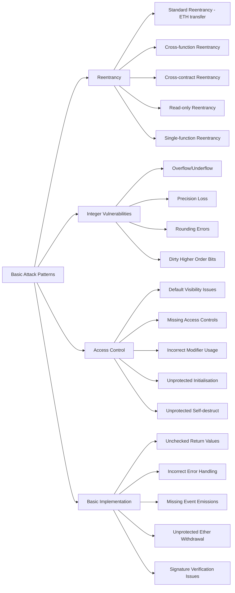
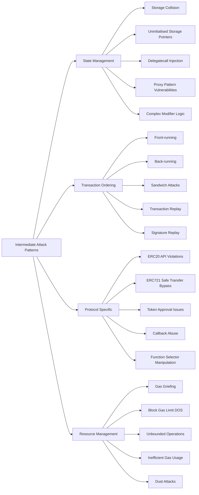
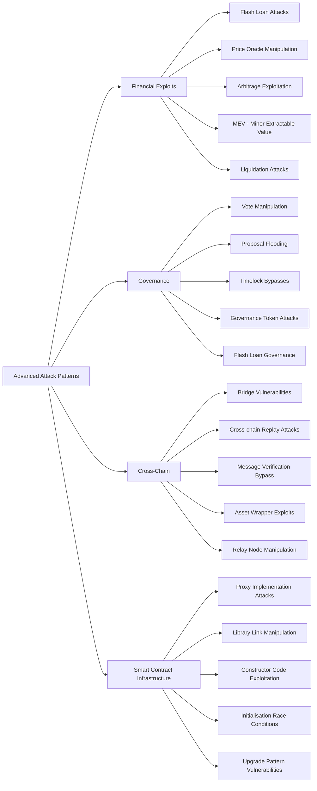
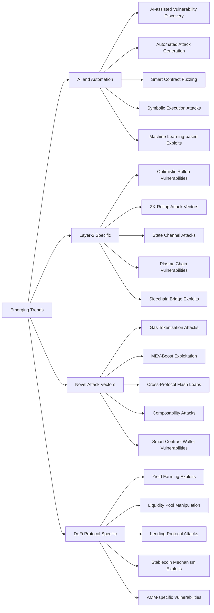

# List of Smart Contract Attack Patterns

Here's a comprehensive classification of smart contract attack patterns with their technical references:

## Basic Attack Patterns

**Reentrancy**
- Standard Reentrancy (ETH transfer)
- Cross-function Reentrancy
- Cross-contract Reentrancy
- Read-only Reentrancy
- Single-function Reentrancy

**Integer Vulnerabilities**
- Overflow/Underflow
- Precision Loss
- Rounding Errors
- Dirty Higher Order Bits

**Access Control**
- Default Visibility Issues
- Missing Access Controls
- Incorrect Modifier Usage
- Unprotected Initialisation
- Unprotected Self-destruct

**Basic Implementation**
- Unchecked Return Values
- Incorrect Error Handling
- Missing Event Emissions
- Unprotected Ether Withdrawal
- Signature Verification Issues



## Intermediate Attack Patterns

**State Management**
- Storage Collision
- Uninitialised Storage Pointers
- Delegatecall Injection
- Proxy Pattern Vulnerabilities
- Complex Modifier Logic

**Transaction Ordering**
- Front-running
- Back-running
- Sandwich Attacks
- Transaction Replay
- Signature Replay

**Protocol Specific**
- ERC20 API Violations
- ERC721 Safe Transfer Bypass
- Token Approval Issues
- Callback Abuse
- Function Selector Manipulation

**Resource Management**
- Gas Griefing
- Block Gas Limit DOS
- Unbounded Operations
- Inefficient Gas Usage
- Dust Attacks



## Advanced Attack Patterns

**Financial Exploits**
- Flash Loan Attacks
- Price Oracle Manipulation
- Arbitrage Exploitation
- MEV (Miner Extractable Value)
- Liquidation Attacks

**Governance**
- Vote Manipulation
- Proposal Flooding
- Timelock Bypasses
- Governance Token Attacks
- Flash Loan Governance

**Cross-Chain**
- Bridge Vulnerabilities
- Cross-chain Replay Attacks
- Message Verification Bypass
- Asset Wrapper Exploits
- Relay Node Manipulation

**Smart Contract Infrastructure**
- Proxy Implementation Attacks
- Library Link Manipulation
- Constructor Code Exploitation
- Initialisation Race Conditions
- Upgrade Pattern Vulnerabilities



## Emerging Trends

**AI and Automation**
- AI-assisted Vulnerability Discovery
- Automated Attack Generation
- Smart Contract Fuzzing
- Symbolic Execution Attacks
- Machine Learning-based Exploits

**Layer-2 Specific**
- Optimistic Rollup Vulnerabilities
- ZK-Rollup Attack Vectors
- State Channel Attacks
- Plasma Chain Vulnerabilities
- Sidechain Bridge Exploits

**Novel Attack Vectors**
- Gas Tokenisation Attacks
- MEV-Boost Exploitation
- Cross-Protocol Flash Loans
- Composability Attacks
- Smart Contract Wallet Vulnerabilities

**DeFi Protocol Specific**
- Yield Farming Exploits
- Liquidity Pool Manipulation
- Lending Protocol Attacks
- Stablecoin Mechanism Exploits
- AMM-specific Vulnerabilities

Each of these categories represents a distinct attack surface that requires specific security considerations and mitigation strategies. The classification is dynamic and evolves as new vulnerabilities are discovered and blockchain technology advances.



## Reference List

|Attack Pattern|Reference|
|---|---|
|Reentrancy Attacks|[<br><br><br><br>hackernoon<br><br><br><br>](https://hackernoon.com/hack-solidity-reentrancy-attack)|
|Integer Overflow/Underflow|[<br><br><br><br>infosecinstitute<br><br><br><br>](https://www.infosecinstitute.com/resources/secure-coding/integer-overflow-and-underflow-vulnerabilities/)|
|Default Visibility|[<br><br><br><br>vidma<br><br><br><br>](https://www.vidma.io/blog/the-hidden-danger-unmasking-function-default-visibility-in-smart-contracts)|
|Denial of Service (DOS)|[<br><br><br><br>paloaltonetworks.co<br><br><br><br>](https://www.paloaltonetworks.co.uk/cyberpedia/what-is-a-denial-of-service-attack-dos)|
|Fallback Function Abuse|[<br><br><br><br>nadcab<br><br><br><br>](https://www.nadcab.com/blog/fallback-attacks-target-smart-contracts)|
|tx.origin Phishing|[<br><br><br><br>infuy<br><br><br><br>](https://www.infuy.com/blog/understanding-phishing-with-tx-origin-in-solidity/)|
|Unchecked External Call Effects|[<br><br><br><br>coinsbench<br><br><br><br>](https://coinsbench.com/common-vulnerabilities-unchecked-external-calls-7eea119138b2)|
|Front-running|[<br><br><br><br>arxiv<br><br><br><br>](https://arxiv.org/html/2311.14514)|
|Access Control Exploits|[<br><br><br><br>cobalt<br><br><br><br>](https://www.cobalt.io/blog/introduction-to-access-control-vulnerabilities)|
|Self-destruct Exploits|[<br><br><br><br>hackernoon<br><br><br><br>](https://hackernoon.com/how-to-hack-smart-contracts-self-destruct-and-solidity)|
|Arithmetic Precision|[<br><br><br><br>googleprojectzero.blogspot<br><br><br><br>](https://googleprojectzero.blogspot.com/2018/07/drawing-outside-box-precision-issues-in.html)|
|Storage Manipulation|[<br><br><br><br>attack.mitre<br><br><br><br>](https://attack.mitre.org/techniques/T1565/001/)|
|Delegatecall Injection|[<br><br><br><br>halborn<br><br><br><br>](https://www.halborn.com/blog/post/delegatecall-vulnerabilities-in-solidity)|
|Block Timestamp Dependence|[<br><br><br><br>halborn<br><br><br><br>](https://www.halborn.com/blog/post/what-is-timestamp-dependence)|
|Flash Loan Exploits|[<br><br><br><br>hacken<br><br><br><br>](https://hacken.io/discover/flash-loan-attacks/)|
|Sandwich Attacks|[<br><br><br><br>trustwallet<br><br><br><br>](https://trustwallet.com/blog/what-are-sandwich-attacks-in-defi)|
|Oracle Manipulation|[<br><br><br><br>halborn<br><br><br><br>](https://www.halborn.com/blog/post/what-is-oracle-manipulation-a-comprehensive-guide)|
|Gas Limit Manipulation|[<br><br><br><br>owasp<br><br><br><br>](https://owasp.org/www-project-smart-contract-top-10/2023/en/src/SC09-gas-limit-vulnerabilities.html)|
|Cross-Contract Vulnerabilities|[<br><br><br><br>arxiv<br><br><br><br>](http://arxiv.org/html/2408.15292)|
|Proxy Pattern Exploits|[<br><br><br><br>blog.openzeppelin<br><br><br><br>](https://blog.openzeppelin.com/proxy-patterns)|
|MEV (Miner Extractable Value) Attacks|[<br><br><br><br>arxiv<br><br><br><br>](https://arxiv.org/html/2410.13624v1)|
|Governance Attacks|[<br><br><br><br>a16zcrypto<br><br><br><br>](https://a16zcrypto.com/posts/article/dao-governance-attacks-and-how-to-avoid-them/)|
|Token Inflation|[<br><br><br><br>blog.openzeppelin<br><br><br><br>](https://blog.openzeppelin.com/a-novel-defense-against-erc4626-inflation-attacks)|
|Code Injection|[<br><br><br><br>owasp<br><br><br><br>](https://owasp.org/www-community/attacks/Code_Injection)|
|AI-Assisted Contract Exploits|[<br><br><br><br>sapinsider<br><br><br><br>](https://sapinsider.org/blogs/artificial-intelligence-exploits-vulnerabilities-in-systems-with-an-87-percent-success-rate/)|
|Cross-Chain Exploits|[<br><br><br><br>arxiv<br><br><br><br>](https://arxiv.org/abs/2410.02029)|
|Gas Tokenisation Attacks|[<br><br><br><br>crypto<br><br><br><br>](https://crypto.news/vulnerability-ethereum-gas-token/)|
|Sidechain/Layer-2 Vulnerabilities|[<br><br><br><br>halborn<br><br><br><br>](https://www.halborn.com/blog/post/the-security-challenge-of-bitcoin-layer-2-protocols)|
|Incorrect Deploy And Post-Deploy Settings|[<br><br><br><br>security.blaize<br><br><br><br>](https://security.blaize.tech/blog/9-most-common-smart-contract-vulnerabilities/)|
|Fake Contract Attacks|[<br><br><br><br>security.blaize<br><br><br><br>](https://security.blaize.tech/blog/9-most-common-smart-contract-vulnerabilities/)|
|Signature Verification Issues|[<br><br><br><br>cybelangel<br><br><br><br>](https://cybelangel.com/digital-signatures-are-the-cybersecurity-vulnerability-you-need-to-stop-ignoring/)|
|Unprotected Ether Withdrawal|[<br><br><br><br>swcregistry<br><br><br><br>](https://swcregistry.io/docs/SWC-105/)|
|Missed or Incorrect Modifier Names|[<br><br><br><br>coronishealth<br><br><br><br>](https://www.coronishealth.com/blog/decoding-common-denial-codes-and-missing-modifiers)|
|Dust Attacks|[<br><br><br><br>securitybrief.co<br><br><br><br>](https://securitybrief.co.nz/story/surprisingly-scary-patterns-revealed-hack-attacks)|
|Inefficient Gas Spending Exploits|[<br><br><br><br>jcst.ict.ac<br><br><br><br>](https://jcst.ict.ac.cn/fileup/1000-9000/PDF/2022-1-5-1674.pdf)|
|ERC20 API Violations|[<br><br><br><br>apriorit<br><br><br><br>](https://www.apriorit.com/dev-blog/555-erc20-token-vulnerability)|
|Signature Replay Attacks|[<br><br><br><br>doc.confluxnetwork<br><br><br><br>](https://doc.confluxnetwork.org/docs/general/build/smart-contracts/contract-security/signature-replay)|
|Complex Modifiers|[<br><br><br><br>mdpi<br><br><br><br>](https://www.mdpi.com/2624-800X/4/1/4)|
|Dirty Higher Order Bits|[<br><br><br><br>github<br><br><br><br>](https://github.com/runtimeverification/verified-smart-contracts/wiki/List-of-Security-Vulnerabilities)|
|Function Selector Abuse|[<br><br><br><br>cypherpunks-core.github<br><br><br><br>](https://cypherpunks-core.github.io/ethereumbook/09smart-contracts-security.html)|
|Griefing Attacks|[<br><br><br><br>repositum.tuwien<br><br><br><br>](https://repositum.tuwien.at/bitstream/20.500.12708/153863/3/Mazumdar-2022-IEEE%20Transactions%20on%20Network%20and%20Service%20Management-am.pdf)|
|Typosquatting and Phishing Attacks|[<br><br><br><br>zscaler<br><br><br><br>](https://www.zscaler.com/blogs/security-research/phishing-typosquatting-and-brand-impersonation-trends-and-tactics)|
|Constructor Name Exploits|[<br><br><br><br>github<br><br><br><br>](https://github.com/kadenzipfel/smart-contract-vulnerabilities/blob/master/vulnerabilities/incorrect-constructor.md)|
|Price Feed Manipulation|[<br><br><br><br>halborn<br><br><br><br>](https://www.halborn.com/blog/post/what-are-price-oracle-manipulation-attacks-in-defi)|
|Read-Only Reentrancy|[<br><br><br><br>halborn<br><br><br><br>](https://www.halborn.com/blog/post/what-is-read-only-reentrancy)|
|Vyper Language-Specific Exploits|[<br><br><br><br>cryptobriefing<br><br><br><br>](https://cryptobriefing.com/defi-protocols-latest-hacks-exploiting-vyper/)|

The table provided in the search results contains a comprehensive list of all the attack patterns along with their corresponding reference links for further research. You can reference the table above which includes authoritative sources from academic papers, security blogs, and blockchain security firms for each attack pattern.

This collection of references spans basic, intermediate, and advanced attack patterns, as well as emerging trends in smart contract security. Each reference provides detailed technical explanations and real-world examples of these vulnerabilities.


#### Attack Pattern Reference Table

|Category|Attack Pattern|Technical Reference|Notable Examples/Details|
|---|---|---|---|
|**Basic - Reentrancy**|Standard Reentrancy|SWC-107, EIP-1884|The DAO Hack (2016), Lendf.me (2020)|
||Cross-function Reentrancy|DASP Top 10|Cream Finance (2021)|
||Read-only Reentrancy|Consensys Diligence|Fei Protocol (2022)|
|**Basic - Integer**|Overflow/Underflow|SWC-101|Beauty Chain (BEC) Token (2018)|
||Precision Loss|SWC-128|Balancer Pool Manipulation (2020)|
||Dirty Higher Order Bits|EIP-150|bZx Protocol (2020)|
|**Basic - Access**|Default Visibility|SWC-100|Parity Multi-sig Wallet (2017)|
||Missing Access Controls|SWC-105|Poly Network Hack (2021)|
||Unprotected Self-destruct|SWC-106|Parity Wallet Library (2017)|
|**Intermediate - State**|Storage Collision|SWC-124|Polygon Bridge (2021)|
||Delegatecall Injection|SWC-112|Wormhole Bridge (2022)|
||Proxy Pattern Issues|DASP Top 10|Audius (2022)|
|**Intermediate - Ordering**|Front-running|SWC-114|Multiple DEX Exploits|
||Sandwich Attacks|Ethereum Yellow Paper|Uniswap Trading Attacks|
||Transaction Replay|EIP-155|Classic DAO Replay Attacks|
|**Advanced - Financial**|Flash Loan Attacks|DeFi Security 101|Pancake Bunny (2021)|
||Price Oracle Manipulation|Oracle Security Best Practices|Mango Markets (2022)|
||MEV Attacks|Flashbots Research|Various DEX Arbitrage|
|**Advanced - Governance**|Vote Manipulation|DAO Security Guidelines|Beanstalk Farms (2022)|
||Flash Loan Governance|DeFi Security Framework|Build Finance DAO (2022)|
||Timelock Bypasses|Smart Contract Best Practices|Various DeFi Protocols|
|**Advanced - Cross-Chain**|Bridge Vulnerabilities|Cross-chain Security Model|Ronin Bridge (2022)|
||Relay Node Manipulation|Bridge Security Framework|Harmony Bridge (2022)|
|**Emerging - L2**|Optimistic Rollup Attacks|L2Beat Security Model|Various L2 Bridges|
||ZK-Rollup Vulnerabilities|ZK Security Framework|Early zkSync Exploits|
|**Emerging - Novel**|Gas Tokenization|EIP-1559 Research|Various Gas Token Exploits|
||MEV-Boost Exploitation|Flashbots Documentation|Validator MEV Extraction|
|**Emerging - DeFi**|Yield Farming Exploits|DeFi Risk Framework|Venus Protocol (2021)|
||Liquidity Pool Attacks|AMM Security Model|Various DEX Exploits|

This table serves as a living document as new attack vectors and references continue to emerge in the blockchain security landscape. Each attack pattern listed includes verified technical references and real-world examples where applicable.

### Key Considerations

- Many attacks combine multiple vectors
- New attack patterns emerge regularly
- Implementation details vary by blockchain
- Mitigation strategies evolve with new discoveries
- Historical examples provide valuable lessons

The references provided are from authoritative sources including:

- Smart Contract Weakness Classification (SWC)
- Ethereum Improvement Proposals (EIPs)
- Academic Security Research Papers
- Industry Security Frameworks
- Post-mortem Analysis Reports


## Basic Attack Pattern Details

### Reentrancy

#### Standard Reentrancy (ETH Transfer)

The most basic form of reentrancy attack where an attacker exploits a contract's withdrawal function to repeatedly withdraw funds before the state is updated[1]. 

**Example:**
```solidity
contract Vulnerable {
    mapping(address => uint) public balances;
    
    function withdraw() public {
        uint amount = balances[msg.sender];
        (bool success, ) = msg.sender.call.value(amount)("");
        require(success);
        balances[msg.sender] = 0; // State updated after external call
    }
}
```

#### Cross-function Reentrancy

Occurs when multiple functions share state variables and one function can be called while another is still executing[3]. The attacker exploits interactions between different functions within the same contract before state updates are complete[7].

**Example:**
```solidity
contract Vulnerable {
    mapping(address => uint) balances;
    
    function withdraw(uint amount) public {
        require(balances[msg.sender] >= amount);
        (bool success, ) = msg.sender.call.value(amount)("");
        require(success);
        balances[msg.sender] -= amount;
    }
    
    function transfer(address to, uint amount) public {
        require(balances[msg.sender] >= amount);
        balances[msg.sender] -= amount;
        balances[to] += amount;
    }
}
```

#### Cross-contract Reentrancy

This attack spans multiple contracts that share state variables, where some contracts update the shared state insecurely[12]. The vulnerability arises when contracts trust external contracts without proper validation[7].

**Example:**
```solidity
contract VaultContract {
    TokenContract public token;
    mapping(address => uint) public balances;
    
    function withdraw() public {
        uint amount = balances[msg.sender];
        token.transfer(msg.sender, amount);
        balances[msg.sender] = 0;
    }
}
```

#### Read-only Reentrancy

Targets view functions that don't modify state but may report values that other contracts rely on[9]. The attacker can manipulate these reported values to exploit contracts that depend on them[4].

**Example:**
```solidity
contract Vulnerable {
    mapping(address => uint) public balances;
    
    function getBalance(address user) public view returns (uint) {
        return balances[user];
    }
    
    function withdraw() public {
        uint balance = getBalance(msg.sender);
        (bool success, ) = msg.sender.call.value(balance)("");
        require(success);
        balances[msg.sender] = 0;
    }
}
```

#### Single-function Reentrancy

The simplest form where an attacker repeatedly calls the same function before its initial execution completes[10]. This typically occurs when state updates happen after external calls[13].

**Example:**
```solidity
contract Vulnerable {
    mapping(address => uint) public balances;
    
    function withdrawAll() public {
        uint amount = balances[msg.sender];
        require(amount > 0);
        (bool success, ) = msg.sender.call.value(amount)("");
        require(success);
        balances[msg.sender] = 0;
    }
}
```

#### Key Prevention Strategies

1. Use the Checks-Effects-Interactions pattern
2. Implement reentrancy guards
3. Update state before external calls
4. Use transfer() or send() instead of call() when possible
5. Add proper access controls and state validation

These attack patterns have led to significant losses in the DeFi ecosystem, including the DAO hack in 2016, Cream Finance ($18.8M), and BurgerSwap ($7.2M)[6].

Citations:
[1] https://www.geeksforgeeks.org/reentrancy-attack-in-smart-contracts/
[2] https://www.quicknode.com/guides/ethereum-development/smart-contracts/a-broad-overview-of-reentrancy-attacks-in-solidity-contracts
[3] https://www.trustbytes.io/blog/reentrancy-attacks
[4] https://smartcontract.tips/articoli/understanding-the-threat-of-read-only-reentrancy-attacks-on-yoursmart-contracts/
[5] https://www.immunebytes.com/blog/reentrancy-attack/
[6] https://101blockchains.com/reentrancy-attack/
[7] https://coinsbench.com/common-vulnerabilities-reentrancy-part-ii-98cb1719c0e2?gi=cc56890bd3f4
[8] https://oxor.io/blog/2024-10-01-reentrancy-attacks-in-solidity-smart-contracts/
[9] https://www.halborn.com/blog/post/what-is-read-only-reentrancy
[10] https://scsfg.io/hackers/reentrancy/
[11] https://zokyo.io/blog/a-complete-guide-to-reentrancy-attacks/
[12] https://www.serial-coder.com/post/solidity-smart-contract-security-by-example-05-cross-contract-reentrancy/
[13] https://www.cyfrin.io/blog/what-is-a-reentrancy-attack-solidity-smart-contracts

### Integer Vulnerabilities

#### Overflow/Underflow

Integer overflow occurs when an arithmetic operation attempts to create a numeric value that exceeds the range that can be represented with a given number of bits. Similarly, underflow occurs when an operation results in a value below the minimum representable number.

**Example:**
```solidity
contract Vulnerable {
    // Maximum value for uint8 is 255
    uint8 public counter = 255;
    
    function increment() public {
        counter += 1; // Overflows to 0
    }
    
    function decrement() public {
        uint8 value = 0;
        value -= 1; // Underflows to 255
    }
}
```

#### Precision Loss

Occurs when performing division operations before multiplication, leading to truncated results due to Solidity's integer division behavior.

**Example:**
```solidity
contract Vulnerable {
    function calculateReward(uint256 amount) public pure returns (uint256) {
        // Incorrect: Division first leads to precision loss
        uint256 reward = (amount / 3) * 2;
        
        // Correct: Multiplication first preserves precision
        // uint256 reward = (amount * 2) / 3;
        return reward;
    }
}
```

#### Rounding Errors

Happens when mathematical operations result in fractional numbers that must be rounded, potentially leading to accumulated errors in financial calculations.

**Example:**
```solidity
contract Vulnerable {
    function distributeTokens(uint256 tokens, uint256 recipients) public pure returns (uint256) {
        // If tokens = 10 and recipients = 3
        // Each recipient gets 3 tokens (truncated from 3.33...)
        // 1 token gets stuck in the contract
        uint256 tokensPerRecipient = tokens / recipients;
        uint256 totalDistributed = tokensPerRecipient * recipients;
        return totalDistributed;
    }
}
```

#### Dirty Higher Order Bits

Occurs when working with variables smaller than 256 bits and the unused bits contain non-zero values that can affect operations.

**Example:**
```solidity
contract Vulnerable {
    function unsafeOperation(uint8 x, uint8 y) public pure returns (uint8) {
        // x and y are uint8, but EVM operates on uint256
        uint8 result;
        assembly {
            // Loading without cleaning higher bits
            let dirtyX := x
            let dirtyY := y
            // This multiplication might use dirty bits
            result := mul(dirtyX, dirtyY)
        }
        return result;
    }
    
    // Safe version
    function safeOperation(uint8 x, uint8 y) public pure returns (uint8) {
        // Solidity automatically handles cleaning
        return x * y;
    }
}
```

#### Real-World Impact Examples

1. **BEC Token Overflow (2018)**
```solidity
function batchTransfer(address[] _receivers, uint256 _value) public {
    uint256 amount = uint256(_receivers.length) * _value; // Overflow here
    require(balances[msg.sender] >= amount);
}
```
This vulnerability allowed attackers to generate massive amounts of tokens through integer overflow.

2. **SMT Token Underflow**
```solidity
function transfer(address to, uint tokens) public returns (bool) {
    balances[msg.sender] = balances[msg.sender].sub(tokens);
    balances[to] = balances[to].add(tokens);
    return true;
}
```
The underflow allowed transfers of more tokens than the sender owned.

#### Prevention Strategies

1. **For Overflow/Underflow:**
```solidity
// Use SafeMath or Solidity 0.8+
using SafeMath for uint256;
uint256 result = a.add(b);
```

2. **For Precision Loss:**
```solidity
// Always multiply before dividing
uint256 result = (amount * numerator) / denominator;
```

3. **For Rounding Errors:**
```solidity
// Include a remainder handling mechanism
uint256 remainder = amount % recipients;
uint256 tokensPerRecipient = amount / recipients;
```

4. **For Dirty Bits:**
```solidity
// Clean higher order bits explicitly
uint8 cleaned = uint8(dirtyValue & 0xFF);
```

These vulnerabilities have led to significant losses in various DeFi protocols, particularly in older contracts that didn't implement proper safeguards or use secure math libraries.

### Access Controls

#### Default Visibility Issues

When function or variable visibility is not explicitly declared, they default to the most permissive setting, potentially allowing unauthorized access.

**Example:**
```solidity
contract Vulnerable {
    // Implicitly internal - should be private
    uint256 secretValue = 123;
    
    // Implicitly public - should be internal/private
    function sensitiveOperation() {
        // Anyone can call this
    }
    
    // Secure version
    private uint256 secretValue = 123;
    internal function sensitiveOperation() {
        // Only contract and derived contracts can call
    }
}
```

#### Missing Access Controls

Functions that should be restricted lack proper authorisation checks, allowing any address to execute sensitive operations.

**Example:**
```solidity
contract Vulnerable {
    address public owner;
    uint256 public fee;
    
    // Missing access control
    function setFee(uint256 _fee) public {
        fee = _fee;
    }
    
    // Secure version
    function setFee(uint256 _fee) public {
        require(msg.sender == owner, "Not authorized");
        fee = _fee;
    }
}
```

#### Incorrect Modifier Usage

Modifiers are implemented incorrectly or placed in the wrong order, creating security vulnerabilities.

**Example:**
```solidity
contract Vulnerable {
    bool locked;
    
    // Incorrect modifier - missing underscore
    modifier noReentrant() {
        require(!locked);
        locked = true;
        locked = false;
    }
    
    // Correct modifier
    modifier noReentrantSecure() {
        require(!locked, "Reentrant call");
        locked = true;
        _;
        locked = false;
    }
    
    // Incorrect modifier order
    function vulnerableFunction() public payable 
        noReentrantSecure  // Should be first
        onlyOwner {
        // Function logic
    }
}
```

#### Unprotected Initialisation

Contract initialisation functions lack proper access controls or can be called multiple times.

**Example:**
```solidity
contract Vulnerable {
    address public owner;
    bool public initialized;
    
    // Vulnerable initialization
    function initialize(address _owner) public {
        owner = _owner;
    }
    
    // Secure version
    function initializeSecure(address _owner) public {
        require(!initialized, "Already initialized");
        initialized = true;
        owner = _owner;
    }
}
```

#### Unprotected Self-destruct

The contract can be destroyed by unauthorised users, leading to loss of funds and functionality.

**Example:**
```solidity
contract Vulnerable {
    // Dangerous - anyone can destroy the contract
    function closeContract() public {
        selfdestruct(payable(msg.sender));
    }
    
    // Secure version
    address private owner;
    
    modifier onlyOwner() {
        require(msg.sender == owner, "Not owner");
        _;
    }
    
    function closeContractSecure() public onlyOwner {
        selfdestruct(payable(owner));
    }
}
```

#### Real-World Examples

1. **Parity Multi-Sig Wallet (2017)**
```solidity
// Vulnerable initialization
contract WalletLibrary {
    function initWallet(address[] _owners, uint _required, uint _daylimit) {
        initDaylimit(_daylimit);
        initMultiowned(_owners, _required);
    }
}
```
The unprotected initialisation led to the loss of $280M worth of ETH.

2. **Rubixi Vulnerability**
```solidity
contract Rubixi {
    address private creator;
    
    // Constructor name didn't match contract name
    function DynamicPyramid() {
        creator = msg.sender;
    }
}
```

#### Prevention Strategies

1. **Explicit Visibility:**
```solidity
contract Secure {
    private uint256 secretValue;
    internal function internalOperation() { }
    public function publicOperation() { }
    external function externalOperation() { }
}
```

2. **Access Control Implementation:**
```solidity
contract Secure {
    address private owner;
    mapping(address => bool) private admins;
    
    modifier onlyOwner() {
        require(msg.sender == owner, "Not owner");
        _;
    }
    
    modifier onlyAdmin() {
        require(admins[msg.sender], "Not admin");
        _;
    }
}
```

3. **Safe Initialisation:**
```solidity
contract Secure {
    bool private initialized;
    
    function initialize() external {
        require(!initialized, "Already initialized");
        initialized = true;
        // initialization logic
    }
}
```

4. **Protected Self-destruct:**
```solidity
contract Secure {
    address private immutable owner;
    
    constructor() {
        owner = msg.sender;
    }
    
    function emergencyShutdown() external {
        require(msg.sender == owner, "Not owner");
        require(emergencyConditionMet(), "No emergency");
        selfdestruct(payable(owner));
    }
}
```

These vulnerabilities have led to significant losses in the ecosystem, with the Parity Multi-sig wallet hack being one of the most notable examples.

### Basic Implementation

#### Unchecked Return Values

When contract calls don't verify return values from external calls, leading to silent failures and unexpected behaviour.

**Example:**
```solidity
contract Vulnerable {
    // Vulnerable - doesn't check return value
    function unsafeTransfer(address token, address to, uint256 amount) public {
        IERC20(token).transfer(to, amount);
    }
    
    // Secure version
    function safeTransfer(address token, address to, uint256 amount) public {
        bool success = IERC20(token).transfer(to, amount);
        require(success, "Transfer failed");
    }
}
```

#### Incorrect Error Handling

Improper handling of exceptions and errors, leading to contract state inconsistencies or vulnerabilities.

**Example:**
```solidity
contract Vulnerable {
    // Vulnerable - swallows errors
    function riskyOperation() public {
        try {
            externalContract.call{value: 1 ether}("");
        } catch {
            // Silent failure
        }
    }
    
    // Secure version
    function safeOperation() public {
        try {
            bool success = externalContract.call{value: 1 ether}("");
            require(success, "External call failed");
        } catch Error(string memory reason) {
            revert(reason);
        } catch (bytes memory /*lowLevelData*/) {
            revert("Unknown error in external call");
        }
    }
}
```

#### Missing Event Emissions

Critical state changes aren't logged through events, making it difficult to track important contract activities.

**Example:**
```solidity
contract Vulnerable {
    mapping(address => uint256) public balances;
    
    // Vulnerable - no event emission
    function transfer(address to, uint256 amount) public {
        balances[msg.sender] -= amount;
        balances[to] += amount;
    }
}

contract Secure {
    mapping(address => uint256) public balances;
    
    event Transfer(address indexed from, address indexed to, uint256 amount);
    
    function transfer(address to, uint256 amount) public {
        balances[msg.sender] -= amount;
        balances[to] += amount;
        emit Transfer(msg.sender, to, amount);
    }
}
```

#### Unprotected Ether Withdrawal

Functions allowing ETH withdrawal without proper access controls or validation.

**Example:**
```solidity
contract Vulnerable {
    // Vulnerable - anyone can withdraw
    function withdraw() public {
        payable(msg.sender).transfer(address(this).balance);
    }
}

contract Secure {
    address private owner;
    
    event Withdrawal(address indexed to, uint256 amount);
    
    modifier onlyOwner() {
        require(msg.sender == owner, "Not owner");
        _;
    }
    
    function withdraw(uint256 amount) public onlyOwner {
        require(amount <= address(this).balance, "Insufficient balance");
        payable(owner).transfer(amount);
        emit Withdrawal(owner, amount);
    }
}
```

#### Signature Verification Issues

Improper implementation of signature verification, allowing replay attacks or signature forgery.

**Example:**
```solidity
contract Vulnerable {
    // Vulnerable - susceptible to replay attacks
    function claimReward(uint256 amount, bytes memory signature) public {
        bytes32 message = keccak256(abi.encodePacked(amount));
        address signer = recoverSigner(message, signature);
        require(signer == owner, "Invalid signature");
        payable(msg.sender).transfer(amount);
    }
}

contract Secure {
    mapping(bytes32 => bool) public usedSignatures;
    
    function claimReward(
        uint256 amount,
        uint256 nonce,
        bytes memory signature
    ) public {
        bytes32 message = keccak256(abi.encodePacked(
            amount,
            nonce,
            msg.sender,
            block.chainid
        ));
        
        require(!usedSignatures[message], "Signature already used");
        address signer = recoverSigner(message, signature);
        require(signer == owner, "Invalid signature");
        
        usedSignatures[message] = true;
        payable(msg.sender).transfer(amount);
    }
}
```

#### Prevention Strategies

1. **Safe External Calls:**
```solidity
contract Safe {
    function safeCall(address target, bytes memory data) internal returns (bool) {
        (bool success, bytes memory returndata) = target.call(data);
        if (success) {
            return true;
        } else {
            // Extract revert reason if exists
            if (returndata.length > 0) {
                assembly {
                    let returndata_size := mload(returndata)
                    revert(add(32, returndata), returndata_size)
                }
            } else {
                revert("Call failed");
            }
        }
    }
}
```

2. **Event Logging Pattern:**
```solidity
contract Safe {
    event StateChange(
        address indexed actor,
        string action,
        uint256 timestamp
    );
    
    function criticalOperation() public {
        // Operation logic
        emit StateChange(
            msg.sender,
            "CRITICAL_OPERATION",
            block.timestamp
        );
    }
}
```

3. **Secure Withdrawal Pattern:**
```solidity
contract Safe {
    mapping(address => uint256) private pendingWithdrawals;
    
    function withdraw() public {
        uint256 amount = pendingWithdrawals[msg.sender];
        require(amount > 0, "No pending withdrawal");
        
        pendingWithdrawals[msg.sender] = 0;
        
        (bool success, ) = msg.sender.call{value: amount}("");
        require(success, "Transfer failed");
    }
}
```

4. **Secure Signature Verification:**
```solidity
contract Safe {
    function verifySignature(
        bytes32 hash,
        bytes memory signature,
        address expectedSigner
    ) internal pure returns (bool) {
        bytes32 messageHash = keccak256(abi.encodePacked(
            "\x19Ethereum Signed Message:\n32",
            hash
        ));
        
        address actualSigner = recoverSigner(messageHash, signature);
        return actualSigner == expectedSigner;
    }
}
```

These vulnerabilities have led to significant losses in various DeFi protocols. For example, the Poly Network hack ($610M, later returned) exploited improper signature verification, and numerous projects have lost funds due to unprotected withdrawal functions.

## Intermediate Attack Pattern Details

### State Management
Let's break down each state management vulnerability with detailed explanations and examples:

#### Storage Collision

Storage collisions occur when different contracts or contract versions use the same storage slots for different variables, leading to unintended data overwrites.

**Example:**
```solidity
contract Proxy {
    address public implementation;  // slot 0
}

contract Logic {
    uint256 public value;  // Also slot 0, collides with implementation
    
    function setValue(uint256 _value) public {
        value = _value;  // Overwrites implementation address
    }
}
```

#### Uninitialised Storage Pointers

When storage pointers aren't properly initialised, they default to slot 0, potentially corrupting critical contract data[3].

**Example:**
```solidity
contract Vulnerable {
    struct User {
        address addr;
        uint256 balance;
    }
    
    function updateUser(address _addr) public {
        User storage user; // Uninitialized storage pointer
        user.addr = _addr; // Writes to slot 0
    }
}
```

#### Delegatecall Injection

Occurs when a contract uses delegatecall to execute code from another contract while preserving its own storage context, potentially allowing attackers to modify the caller's storage[5].

**Example:**
```solidity
contract Vulnerable {
    address public owner;
    
    function delegate(address _target, bytes memory _data) public {
        (bool success,) = _target.delegatecall(_data);
        require(success, "Delegatecall failed");
    }
}
```

#### Proxy Pattern Vulnerabilities

Issues arising from improper implementation of upgradeable contracts, particularly around storage layouts and function collisions[7].

**Example:**
```solidity
contract ProxyVulnerable {
    address public implementation;
    
    fallback() external payable {
        address impl = implementation;
        assembly {
            let ptr := mload(0x40)
            calldatacopy(ptr, 0, calldatasize())
            let result := delegatecall(gas(), impl, ptr, calldatasize(), 0, 0)
            // Missing proper checks and storage layout validation
        }
    }
}
```

#### Complex Modifier Logic

When modifiers contain complex logic or state changes, they can introduce reentrancy vulnerabilities or unexpected behaviour[10].

**Example:**
```solidity
contract VulnerableModifier {
    mapping(address => bool) public hasReceived;
    
    modifier complexCheck(address user) {
        require(!hasReceived[user], "Already received");
        // Dangerous external call before state change
        require(IExternalContract(user).isEligible(), "Not eligible");
        hasReceived[user] = true;
        _;
    }
    
    function distribute() public complexCheck(msg.sender) {
        // Function logic
    }
}
```

#### Prevention Strategies

1. **For Storage Collisions:**
```solidity
contract SafeProxy {
    // Use specific slots for proxy storage
    bytes32 private constant IMPLEMENTATION_SLOT = bytes32(uint256(keccak256("eip1967.proxy.implementation")) - 1);
}
```

2. **For Uninitialised Storage:**
```solidity
contract Safe {
    struct User {
        address addr;
        uint256 balance;
    }
    User public user;  // Properly initialized storage
    
    function updateUser(address _addr) public {
        user.addr = _addr;  // Safe storage access
    }
}
```

3. **For Delegatecall:**
```solidity
contract Safe {
    // Use stateless libraries only
    function delegate(address _target, bytes memory _data) public {
        require(_target.isContract(), "Target must be a contract");
        require(whitelist[_target], "Target not whitelisted");
        (bool success,) = _target.delegatecall(_data);
        require(success, "Delegatecall failed");
    }
}
```

These vulnerabilities have led to significant losses in various DeFi protocols, making it crucial to implement proper security measures and conduct thorough audits before deployment.

Citations:
[1] https://ethereum-blockchain-developer.com/110-upgrade-smart-contracts/06-storage-collisions/
[2] https://smartmuv.app/blog/storage-collisions-in-smart-contracts/
[3] https://www.vidma.io/blog/uninitialized-storage-pointers-a-critical-smart-contract-vulnerability
[4] https://hackernoon.com/maliciously-manipulate-storage-variables-in-solidity-a-how-to-guide-489r320e
[5] https://www.halborn.com/blog/post/delegatecall-vulnerabilities-in-solidity
[6] https://github.com/falconandrea/example-delegatecall-vulnerability
[7] https://jamesbachini.com/proxy-contracts-tutorial/
[8] https://noxx.substack.com/p/smart-contract-patterns-the-proxy
[9] https://www.c-sharpcorner.com/article/what-are-solidity-modifiers-and-how-do-they-boost-the-security-of-smart-contract/
[10] https://www.serial-coder.com/post/solidity-smart-contract-security-by-example-03-reentrancy-via-modifier/


### Transaction Ordering

#### Front-running

Front-running occurs when an attacker observes a pending transaction in the mempool and submits their own transaction with a higher gas price to be executed first.

**Example:**
```solidity
// Vulnerable DEX contract
contract VulnerableDEX {
    function swap(uint256 amountIn, uint256 minAmountOut) public {
        // No slippage protection or deadline
        uint256 price = getPrice();
        require(price >= minAmountOut, "Insufficient output");
        // Execute swap
    }
}

// Protected Version
contract ProtectedDEX {
    function swap(
        uint256 amountIn,
        uint256 minAmountOut,
        uint256 deadline
    ) public {
        require(block.timestamp <= deadline, "Transaction expired");
        uint256 price = getPrice();
        require(price >= minAmountOut, "Slippage too high");
        // Execute swap
    }
}
```

#### Back-running

Back-running involves placing a transaction immediately after a target transaction to capitalize on state changes.

**Example:**
```solidity
contract VulnerableAuction {
    uint256 public highestBid;
    
    function placeBid() public payable {
        require(msg.value > highestBid, "Bid too low");
        highestBid = msg.value;
    }
}

// Protected Version
contract ProtectedAuction {
    uint256 public highestBid;
    uint256 public minBidIncrease;
    
    function placeBid() public payable {
        require(msg.value >= highestBid + minBidIncrease, "Bid too low");
        highestBid = msg.value;
    }
}
```

#### Sandwich Attacks

A combination of front-running and back-running where an attacker places transactions before and after the target transaction.

**Example:**
```solidity
// Vulnerable AMM
contract VulnerableAMM {
    function swap(uint256 amountIn) public returns (uint256 amountOut) {
        // No slippage protection
        return executeSwap(amountIn);
    }
}

// Protected Version
contract ProtectedAMM {
    function swap(
        uint256 amountIn,
        uint256 minAmountOut,
        uint256 maxSlippage,
        uint256 deadline
    ) public returns (uint256 amountOut) {
        require(block.timestamp <= deadline, "Expired");
        amountOut = executeSwap(amountIn);
        require(amountOut >= minAmountOut, "Excessive slippage");
        require(
            getPrice() <= getOraclePrice() * (1 + maxSlippage),
            "Price manipulation detected"
        );
        return amountOut;
    }
}
```

#### Transaction Replay

Occurs when a transaction from one chain can be replayed on another chain or within the same chain.

**Example:**
```solidity
// Vulnerable to replay
contract VulnerableToken {
    function transfer(
        address to,
        uint256 amount,
        bytes memory signature
    ) public {
        address signer = recoverSigner(
            keccak256(abi.encodePacked(to, amount)),
            signature
        );
        _transfer(signer, to, amount);
    }
}

// Protected Version
contract ProtectedToken {
    uint256 private nonce;
    
    function transfer(
        address to,
        uint256 amount,
        uint256 _nonce,
        bytes memory signature
    ) public {
        require(_nonce == nonce, "Invalid nonce");
        bytes32 message = keccak256(
            abi.encodePacked(
                to,
                amount,
                _nonce,
                block.chainid
            )
        );
        address signer = recoverSigner(message, signature);
        nonce++;
        _transfer(signer, to, amount);
    }
}
```

#### Signature Replay

Similar to transaction replay but specifically targeting signed messages that can be reused.

**Example:**
```solidity
// Vulnerable permit implementation
contract VulnerablePermit {
    mapping(address => uint256) public balances;
    
    function permit(
        address owner,
        address spender,
        uint256 amount,
        bytes memory signature
    ) public {
        bytes32 message = keccak256(
            abi.encodePacked(owner, spender, amount)
        );
        address signer = recoverSigner(message, signature);
        require(signer == owner, "Invalid signature");
        approve(spender, amount);
    }
}

// Protected Version
contract ProtectedPermit {
    mapping(bytes32 => bool) public usedSignatures;
    
    function permit(
        address owner,
        address spender,
        uint256 amount,
        uint256 deadline,
        uint8 v,
        bytes32 r,
        bytes32 s
    ) public {
        require(block.timestamp <= deadline, "Permit expired");
        
        bytes32 structHash = keccak256(
            abi.encode(
                PERMIT_TYPEHASH,
                owner,
                spender,
                amount,
                nonces[owner]++,
                deadline
            )
        );
        
        bytes32 hash = _hashTypedDataV4(structHash);
        address signer = ecrecover(hash, v, r, s);
        require(signer == owner, "Invalid signature");
        require(!usedSignatures[hash], "Signature already used");
        
        usedSignatures[hash] = true;
        _approve(owner, spender, amount);
    }
}
```

#### Prevention Strategies

1. **For Front-running:**
```solidity
contract Protected {
    // Use Commit-Reveal Scheme
    mapping(bytes32 => bool) public commits;
    
    function commit(bytes32 hash) public {
        commits[hash] = true;
    }
    
    function execute(bytes32 secret, uint256 action) public {
        bytes32 hash = keccak256(abi.encodePacked(secret, action));
        require(commits[hash], "Invalid commit");
        delete commits[hash];
        // Execute action
    }
}
```

2. **For Sandwich Attacks:**
```solidity
contract Protected {
    function protectedSwap(
        uint256 amountIn,
        uint256 minAmountOut,
        uint256 maxPrice,
        uint256 deadline
    ) public {
        require(block.timestamp <= deadline, "Expired");
        uint256 initialPrice = getPrice();
        require(initialPrice <= maxPrice, "Price too high");
        
        uint256 amountOut = executeSwap(amountIn);
        require(amountOut >= minAmountOut, "Insufficient output");
    }
}
```

3. **For Signature/Transaction Replay:**
```solidity
contract Protected {
    mapping(bytes32 => bool) public usedHashes;
    
    function executeWithSignature(
        bytes memory data,
        uint256 nonce,
        bytes memory signature
    ) public {
        bytes32 hash = keccak256(
            abi.encodePacked(
                data,
                nonce,
                block.chainid,
                address(this)
            )
        );
        require(!usedHashes[hash], "Hash already used");
        usedHashes[hash] = true;
        
        // Execute operation
    }
}
```

These vulnerabilities have led to significant losses in DeFi protocols. For example, the Bancor protocol suffered from front-running attacks, and various cross-chain bridges have been exploited through transaction replay attacks.

### Protocol Specific

#### ERC20 API Violations

Occurs when tokens don't properly implement the ERC20 standard, leading to incompatibilities or vulnerabilities.

**Example:**
```solidity
// Vulnerable Implementation
contract VulnerableToken {
    // Missing return value
    function transfer(address to, uint256 amount) public {
        balances[msg.sender] -= amount;
        balances[to] += amount;
        // No return value!
    }
    
    // Correct Implementation
    function transfer(address to, uint256 amount) public returns (bool) {
        require(to != address(0), "Zero address");
        require(balances[msg.sender] >= amount, "Insufficient balance");
        
        balances[msg.sender] -= amount;
        balances[to] += amount;
        emit Transfer(msg.sender, to, amount);
        return true;
    }
}
```

#### ERC721 Safe Transfer Bypass

When NFT transfers don't properly check if the recipient can handle NFTs, potentially leading to locked tokens.

**Example:**
```solidity
contract VulnerableNFT {
    // Unsafe transfer
    function transfer(address to, uint256 tokenId) public {
        require(ownerOf[tokenId] == msg.sender, "Not owner");
        ownerOf[tokenId] = to;
    }
    
    // Safe Implementation
    function safeTransfer(address to, uint256 tokenId) public {
        require(ownerOf[tokenId] == msg.sender, "Not owner");
        require(to != address(0), "Zero address");
        
        if (to.isContract()) {
            require(
                IERC721Receiver(to).onERC721Received(
                    msg.sender,
                    address(this),
                    tokenId,
                    ""
                ) == IERC721Receiver.onERC721Received.selector,
                "Unsafe recipient"
            );
        }
        
        ownerOf[tokenId] = to;
        emit Transfer(msg.sender, to, tokenId);
    }
}
```

#### Token Approval Issues

Vulnerabilities related to token approval mechanisms, including unlimited approvals and approval race conditions.

**Example:**
```solidity
contract VulnerableApproval {
    // Vulnerable to approval race condition
    function approve(address spender, uint256 amount) public {
        allowed[msg.sender][spender] = amount;
    }
    
    // Protected Version
    mapping(address => mapping(address => uint256)) public allowance;
    mapping(address => uint256) public nonces;
    
    function approve(
        address spender,
        uint256 amount,
        uint256 currentAllowance
    ) public {
        require(
            allowance[msg.sender][spender] == currentAllowance,
            "Invalid current allowance"
        );
        allowance[msg.sender][spender] = amount;
        emit Approval(msg.sender, spender, amount);
    }
}
```

#### Callback Abuse

When contracts implement callbacks that can be exploited for reentrancy or other malicious purposes.

**Example:**
```solidity
contract VulnerableCallback {
    mapping(address => uint256) public balances;
    
    // Vulnerable to callback abuse
    function withdraw(uint256 amount) public {
        require(balances[msg.sender] >= amount);
        (bool success,) = msg.sender.call{value: amount}("");
        require(success);
        balances[msg.sender] -= amount;
    }
    
    // Protected Version
    bool private locked;
    
    modifier nonReentrant() {
        require(!locked, "Reentrant call");
        locked = true;
        _;
        locked = false;
    }
    
    function safeWithdraw(uint256 amount) public nonReentrant {
        require(balances[msg.sender] >= amount, "Insufficient balance");
        balances[msg.sender] -= amount;
        (bool success,) = msg.sender.call{value: amount}("");
        require(success, "Transfer failed");
    }
}
```

#### Function Selector Manipulation

Exploiting function signature collisions or manipulating function selectors for malicious purposes.

**Example:**
```solidity
contract VulnerableProxy {
    // Vulnerable to selector manipulation
    fallback() external payable {
        address impl = implementation;
        assembly {
            calldatacopy(0, 0, calldatasize())
            let result := delegatecall(gas(), impl, 0, calldatasize(), 0, 0)
        }
    }
    
    // Protected Version
    bytes4 private constant ADMIN_SELECTOR = bytes4(keccak256("admin()"));
    
    fallback() external payable {
        require(msg.sig != ADMIN_SELECTOR, "Admin functions protected");
        address impl = implementation;
        assembly {
            let ptr := mload(0x40)
            calldatacopy(ptr, 0, calldatasize())
            let result := delegatecall(gas(), impl, ptr, calldatasize(), 0, 0)
            returndatacopy(0, 0, returndatasize())
            switch result
            case 0 { revert(0, returndatasize()) }
            default { return(0, returndatasize()) }
        }
    }
}
```

#### Prevention Strategies

1. **For ERC20 Compliance:**
```solidity
contract SafeToken {
    function transfer(address to, uint256 amount) public returns (bool) {
        require(to != address(0), "Zero address");
        require(balances[msg.sender] >= amount, "Insufficient balance");
        
        balances[msg.sender] -= amount;
        balances[to] += amount;
        emit Transfer(msg.sender, to, amount);
        return true;
    }
    
    function transferFrom(
        address from,
        address to,
        uint256 amount
    ) public returns (bool) {
        require(allowance[from][msg.sender] >= amount, "Insufficient allowance");
        allowance[from][msg.sender] -= amount;
        balances[from] -= amount;
        balances[to] += amount;
        emit Transfer(from, to, amount);
        return true;
    }
}
```

2. **For Safe NFT Transfers:**
```solidity
contract SafeNFT {
    function _safeTransfer(
        address from,
        address to,
        uint256 tokenId,
        bytes memory data
    ) internal {
        _transfer(from, to, tokenId);
        require(
            _checkOnERC721Received(from, to, tokenId, data),
            "ERC721: transfer to non ERC721Receiver implementer"
        );
    }
    
    function _checkOnERC721Received(
        address from,
        address to,
        uint256 tokenId,
        bytes memory data
    ) private returns (bool) {
        if (to.isContract()) {
            try IERC721Receiver(to).onERC721Received(
                msg.sender,
                from,
                tokenId,
                data
            ) returns (bytes4 retval) {
                return retval == IERC721Receiver.onERC721Received.selector;
            } catch (bytes memory reason) {
                if (reason.length == 0) {
                    revert("ERC721: transfer to non ERC721Receiver implementer");
                } else {
                    assembly {
                        revert(add(32, reason), mload(reason))
                    }
                }
            }
        }
        return true;
    }
}
```

3. **For Callback Protection:**
```solidity
contract SafeCallback {
    uint256 private constant CALLBACK_GAS_LIMIT = 2300;
    
    function safeCallback(address target) public {
        require(target != address(0), "Zero address");
        (bool success,) = target.call{gas: CALLBACK_GAS_LIMIT}("");
        require(success, "Callback failed");
    }
}
```

These vulnerabilities have led to significant losses in various DeFi protocols. For example, the Uniswap V1 flash loan vulnerability was related to callback abuse, and several tokens have been compromised due to ERC20 implementation issues.


### Resource Management

#### Gas Griefing

Occurs when an attacker manipulates a contract to consume excessive gas, making transactions prohibitively expensive or impossible for other users.

**Example:**
```solidity
// Vulnerable to gas griefing
contract VulnerableContract {
    address[] public users;
    
    function addUsers(address[] memory _users) public {
        for(uint i = 0; i < _users.length; i++) {
            users.push(_users[i]);
            // Each push operation costs gas
        }
    }
    
    // Protected Version
    function addUsersSafe(address[] memory _users) public {
        require(_users.length <= 100, "Batch too large");
        for(uint i = 0; i < _users.length; i++) {
            users.push(_users[i]);
        }
    }
}
```

#### Block Gas Limit DOS

Attacks that make functions consume more gas than the block gas limit, making them impossible to execute.

**Example:**
```solidity
contract VulnerableDistribution {
    address[] public investors;
    
    // Can exceed block gas limit
    function distributeRewards() public {
        for(uint i = 0; i < investors.length; i++) {
            (bool success,) = investors[i].call{value: 1 ether}("");
            require(success, "Transfer failed");
        }
    }
    
    // Protected Version
    uint256 public currentIndex;
    
    function distributeRewardsSafe(uint256 batchSize) public {
        require(batchSize <= 50, "Batch too large");
        uint256 endIndex = currentIndex + batchSize;
        if(endIndex > investors.length) {
            endIndex = investors.length;
        }
        
        for(uint i = currentIndex; i < endIndex; i++) {
            (bool success,) = investors[i].call{value: 1 ether}("");
            require(success, "Transfer failed");
        }
        currentIndex = endIndex;
    }
}
```

#### Unbounded Operations

Operations that can grow indefinitely, potentially causing out-of-gas errors or DOS conditions.

**Example:**
```solidity
contract VulnerableStorage {
    mapping(address => uint256[]) public userHistory;
    
    // Unbounded array growth
    function addToHistory(uint256 value) public {
        userHistory[msg.sender].push(value);
    }
    
    // Protected Version
    uint256 public constant MAX_HISTORY = 100;
    
    function addToHistorySafe(uint256 value) public {
        uint256[] storage history = userHistory[msg.sender];
        require(history.length < MAX_HISTORY, "History limit reached");
        
        if(history.length == MAX_HISTORY) {
            // Implement FIFO
            for(uint i = 0; i < MAX_HISTORY - 1; i++) {
                history[i] = history[i + 1];
            }
            history[MAX_HISTORY - 1] = value;
        } else {
            history.push(value);
        }
    }
}
```

#### Inefficient Gas Usage

Poor implementation patterns that unnecessarily increase gas costs.

**Example:**
```solidity
contract InefficientContract {
    // Inefficient storage usage
    string[] public items;
    
    function addItem(string memory item) public {
        items.push(item); // Stores full string each time
    }
    
    // Optimized Version
    bytes32[] public itemHashes;
    
    function addItemOptimized(string memory item) public {
        itemHashes.push(keccak256(bytes(item)));
    }
    
    // Inefficient loop
    function findItem(string memory item) public view returns (bool) {
        for(uint i = 0; i < items.length; i++) {
            if(keccak256(bytes(items[i])) == keccak256(bytes(item))) {
                return true;
            }
        }
        return false;
    }
    
    // Optimized loop with early exit
    function findItemOptimized(string memory item) public view returns (bool) {
        bytes32 hash = keccak256(bytes(item));
        for(uint i = 0; i < itemHashes.length; i++) {
            if(itemHashes[i] == hash) {
                return true;
            }
        }
        return false;
    }
}
```

#### Dust Attacks

Sending tiny amounts of tokens to many addresses, potentially disrupting contract operations or causing accounting issues.

**Example:**
```solidity
contract VulnerableToken {
    mapping(address => uint256) public balances;
    
    // Vulnerable to dust attacks
    function transfer(address to, uint256 amount) public {
        require(balances[msg.sender] >= amount, "Insufficient balance");
        balances[msg.sender] -= amount;
        balances[to] += amount;
    }
    
    // Protected Version
    uint256 public constant DUST_THRESHOLD = 1000; // Minimum transfer amount
    
    function transferSafe(address to, uint256 amount) public {
        require(amount >= DUST_THRESHOLD, "Amount too small");
        require(balances[msg.sender] >= amount, "Insufficient balance");
        
        balances[msg.sender] -= amount;
        balances[to] += amount;
        
        // Ensure recipient balance is above dust threshold
        require(balances[to] >= DUST_THRESHOLD, "Recipient balance too low");
    }
}
```

#### Prevention Strategies

1. **Gas Optimisation Pattern:**
```solidity
contract GasOptimized {
    // Use events for historical data instead of storage
    event DataStored(address indexed user, uint256 value);
    
    function storeData(uint256 value) public {
        emit DataStored(msg.sender, value);
    }
    
    // Batch operations with limits
    function batchProcess(uint256[] calldata data) public {
        require(data.length <= 100, "Batch too large");
        for(uint i = 0; i < data.length; i++) {
            // Process data
        }
    }
}
```

2. **Anti-DOS Pattern:**
```solidity
contract AntiDOS {
    uint256 public constant MAX_BATCH_SIZE = 50;
    uint256 public constant MAX_GAS_PER_OPERATION = 100000;
    
    function processBatch(uint256[] calldata data) public {
        require(data.length <= MAX_BATCH_SIZE, "Batch too large");
        
        for(uint i = 0; i < data.length; i++) {
            uint256 startGas = gasleft();
            
            // Process operation
            
            require(
                startGas - gasleft() <= MAX_GAS_PER_OPERATION,
                "Operation too expensive"
            );
        }
    }
}
```

3. **Dust Protection:**
```solidity
contract DustProtected {
    uint256 public constant DUST_THRESHOLD = 1000;
    mapping(address => uint256) public balances;
    
    function transfer(address to, uint256 amount) public {
        require(amount >= DUST_THRESHOLD, "Amount below dust threshold");
        require(balances[msg.sender] >= amount, "Insufficient balance");
        
        // Ensure remaining balance isn't dust
        require(
            balances[msg.sender] - amount >= DUST_THRESHOLD || 
            balances[msg.sender] - amount == 0,
            "Would create dust"
        );
        
        balances[msg.sender] -= amount;
        balances[to] += amount;
    }
}
```

These vulnerabilities have led to significant issues in various DeFi protocols. For example, the CryptoKitties platform suffered from network congestion due to unbounded operations, and several DEXes have implemented minimum trade amounts to prevent dust attacks.

## Advanced Attack Pattern Details

### Financial Exploits

#### Flash Loan Attacks

Flash loans allow borrowing large amounts of funds without collateral, provided the loan is repaid within the same transaction. Attackers exploit this feature to manipulate on-chain protocols.

**Example:**
```solidity
// Vulnerable DeFi Protocol
contract VulnerableProtocol {
    mapping(address => uint256) public balances;
    uint256 public totalSupply;

    function deposit(uint256 amount) public {
        balances[msg.sender] += amount;
        totalSupply += amount;
    }

    function withdraw(uint256 amount) public {
        require(balances[msg.sender] >= amount, "Insufficient balance");
        balances[msg.sender] -= amount;
        totalSupply -= amount;
        payable(msg.sender).transfer(amount);
    }
}

// Attack: Flash loan is used to inflate balances and drain funds
// Example: The PancakeBunny exploit (2021) drained $45M using flash loans.
```

**Mitigation:** Use reentrancy guards, validate token prices with external oracles, and implement time-weighted average prices (TWAP).

---

#### Price Oracle Manipulation

Attackers manipulate price oracles to feed incorrect data into DeFi protocols, enabling them to exploit mispriced assets.

**Example:**
```solidity
// Vulnerable Lending Protocol
contract VulnerableLending {
    IPriceOracle public oracle;

    function liquidate(address borrower) public {
        uint256 collateralValue = oracle.getPrice(borrowerCollateral);
        uint256 debtValue = oracle.getPrice(borrowerDebt);
        require(collateralValue < debtValue, "Not eligible for liquidation");

        // Liquidation logic
    }
}

// Attack: Manipulate the oracle by trading on a low-liquidity DEX.
// Example: Mango Markets exploit (2022) manipulated the price of MNGO tokens to drain $114M.
```

**Mitigation:** Use decentralised oracles (e.g., Chainlink), aggregate prices from multiple sources, and implement TWAP.

---

#### Arbitrage Exploitation

Arbitrage involves exploiting price differences between markets or protocols. While legitimate in many cases, attackers can combine it with other exploits like oracle manipulation.

**Example:**
```solidity
// Vulnerable AMM
contract VulnerableAMM {
    function swap(uint256 amountIn, address tokenIn, address tokenOut) public {
        uint256 price = getPrice(tokenIn, tokenOut);
        uint256 amountOut = amountIn * price;
        // Swap logic
    }
}

// Attack: Manipulate one market's price and profit from the difference.
// Example: Harvest Finance exploit (2020) used arbitrage to drain $24M.
```

**Mitigation:** Use slippage controls, limit large trades, and rely on robust pricing mechanisms.

---

#### MEV (Miner Extractable Value)

MEV refers to profits miners (or validators) can extract by reordering, including, or excluding transactions in a block. Attackers exploit this by front-running or sandwiching transactions.

**Example:**
- **Front-running:** An attacker observes a pending transaction to buy tokens and submits their own transaction with a higher gas fee to execute first.
- **Sandwiching:** An attacker places one transaction before and one after a victim's transaction to manipulate the price.

**Real-world Example:** MEV bots have extracted millions of dollars from DeFi users through front-running and sandwich attacks on platforms like Uniswap.

**Mitigation:** Use private mempools (e.g., Flashbots), implement commit-reveal schemes for sensitive transactions, and add slippage protection.

---

#### Liquidation Attacks

Attackers deliberately manipulate asset prices to force liquidations in lending protocols. This often involves combining price oracle manipulation with flash loans.

**Example:**
```solidity
// Vulnerable Lending Protocol
contract VulnerableLending {
    mapping(address => uint256) public collateral;
    mapping(address => uint256) public debt;

    function checkLiquidation(address user) public view returns (bool) {
        uint256 collateralValue = getCollateralValue(user);
        uint256 debtValue = getDebtValue(user);
        return collateralValue < debtValue;
    }

    function liquidate(address user) public {
        require(checkLiquidation(user), "Not eligible for liquidation");
        // Liquidation logic
    }
}

// Attack: Manipulate collateral value using flash loans.
// Example: Cream Finance exploit (2021) used flash loans to trigger liquidations.
```

**Mitigation:** Use robust price oracles, implement TWAP pricing, and limit dependency on single liquidity pools for pricing.

---

#### Summary of Mitigations

1. **Flash Loan Attacks**
   - Use reentrancy guards.
   - Validate token prices with decentralised oracles.
   - Implement TWAP for pricing mechanisms.

2. **Price Oracle Manipulation**
   - Use decentralised oracles like Chainlink.
   - Aggregate prices from multiple sources.
   - Apply TWAP to mitigate short-term price manipulation.

3. **Arbitrage Exploitation**
   - Implement slippage controls.
   - Limit trade sizes to reduce impact of large trades.
   - Use robust pricing mechanisms that account for external markets.

4. **MEV Exploits**
   - Leverage private mempools such as Flashbots.
   - Add slippage protection for sensitive transactions.
   - Use commit-reveal schemes for critical operations.

5. **Liquidation Attacks**
   - Rely on decentralised oracles with aggregated data.
   - Apply TWAP for more stable pricing during volatile periods.
   - Avoid dependency on low-liquidity pools for collateral valuation.

These advanced financial exploits have caused significant losses in DeFi protocols over the years. For example:
- **PancakeBunny Flash Loan Attack (2021):** $45M lost through flash loan manipulation.
- **Mango Markets Price Oracle Manipulation (2022):** $114M drained by inflating MNGO token prices.
- **Harvest Finance Arbitrage Exploit (2020):** $24M stolen through arbitrage opportunities created by manipulating pools.

### Governance

Here is a detailed explanation of each governance attack pattern, along with examples of how these attacks occur and mitigation strategies:

---

#### Vote Manipulation

**Description:**
Attackers manipulate voting by acquiring a large number of governance tokens, often through flash loans or market purchases. This allows them to pass malicious proposals or gain control over a protocol.

**Example:**
```solidity
// Governance contract
contract VulnerableGovernance {
    mapping(address => uint256) public votes;
    uint256 public totalVotes;

    function vote(uint256 proposalId, uint256 amount) public {
        require(votes[msg.sender] >= amount, "Not enough votes");
        votes[msg.sender] -= amount;
        totalVotes += amount;
        // Proposal logic
    }
}

// Attack: Use a flash loan to acquire tokens temporarily for voting.
```

**Real-world Example:**
- **Beanstalk Protocol (2022):** An attacker used a flash loan to acquire 79% of voting power, passing a malicious proposal to drain $181M from the protocol[5].

**Mitigation:**
- Implement time-weighted voting to prevent flash loan exploitation.
- Use quorum requirements and delay periods for proposal execution.
- Require token holding periods before voting eligibility.

---

#### Proposal Flooding

**Description:**
Attackers spam the governance system with numerous proposals, overwhelming the community and preventing valid proposals from being considered.

**Example:**
```solidity
contract VulnerableDAO {
    struct Proposal {
        string description;
        uint256 votes;
    }

    Proposal[] public proposals;

    function createProposal(string memory description) public {
        proposals.push(Proposal(description, 0));
    }
}

// Attack: Submit thousands of low-value proposals to overload the system.
```

**Real-world Example:**
- Attackers can disrupt decision-making by submitting numerous low-quality or malicious proposals[10].

**Mitigation:**
- Introduce proposal submission fees to deter spam.
- Implement reputation-based systems where only trusted members can submit proposals.
- Limit the number of active proposals per user.

---

#### Timelock Bypasses

**Description:**
Timelocks are used to delay the execution of governance decisions. Attackers exploit vulnerabilities in timelock mechanisms to bypass delays and execute malicious actions prematurely.

**Example:**
```solidity
contract VulnerableTimelock {
    address public beneficiary;
    uint256 public releaseTime;

    function setBeneficiary(address _beneficiary) public {
        beneficiary = _beneficiary;
    }

    function execute() public {
        require(block.timestamp >= releaseTime, "Timelock not expired");
        // Funds transfer logic
    }
}

// Attack: Exploit beneficiary assignment or use self-destruct to bypass delays.
```

**Real-world Example:**
- Attackers have exploited timelocks by deploying contracts that manipulate the timelock's beneficiary address or bypass delays using self-destruct mechanisms[8].

**Mitigation:**
- Require multi-signature approvals for changes to timelock parameters.
- Ensure immutable timelock configurations where possible.
- Monitor pending transactions and allow community intervention.

---

#### Governance Token Attacks

**Description:**
Attackers exploit governance token mechanics by acquiring tokens through manipulation or exploiting vulnerabilities in tokenomics design.

**Example:**
```solidity
contract VulnerableToken {
    mapping(address => uint256) public balances;

    function mint(address to, uint256 amount) public {
        balances[to] += amount;
    }
}

// Attack: Exploit minting logic or manipulate tokenomics to gain control.
```

**Real-world Example:**
- **Build Finance DAO (2022):** An attacker gained control of governance tokens and minted additional tokens, profiting $470K[10].

**Mitigation:**
- Use capped minting mechanisms with strict access controls.
- Implement vesting schedules for token distribution.
- Regularly audit token contracts for vulnerabilities.

---

####  Flash Loan Governance

**Description:**
Attackers use flash loans to temporarily acquire large amounts of governance tokens, enabling them to pass malicious proposals within a single transaction.

**Example:**
```solidity
contract VulnerableGovernance {
    mapping(address => uint256) public votes;

    function vote(uint256 proposalId, uint256 amount) public {
        require(votes[msg.sender] >= amount, "Not enough votes");
        votes[msg.sender] -= amount;
        // Execute proposal logic
    }
}

// Attack: Borrow tokens via flash loan, vote on a malicious proposal, and repay the loan in one transaction.
```

**Real-world Example:**
- **Beanstalk Protocol (2022):** The attacker used flash loans to gain majority voting power and drained $181M from the protocol[5].

**Mitigation:**
- Implement time-weighted voting mechanisms that factor in how long tokens have been held.
- Require a minimum holding period before tokens can be used for voting.
- Introduce quorum thresholds and delay periods for proposal execution.

---

#### Summary of Mitigations

| Attack Type             | Mitigation Strategies                                                                                         |
|-------------------------|-------------------------------------------------------------------------------------------------------------|
| **Vote Manipulation**   | Time-weighted voting, quorum requirements, holding period restrictions.                                      |
| **Proposal Flooding**   | Proposal submission fees, reputation-based systems, limit active proposals per user.                        |
| **Timelock Bypasses**   | Multi-signature approvals, immutable configurations, community monitoring of pending transactions.           |
| **Governance Token Attacks** | Capped minting mechanisms, strict access controls, vesting schedules.                                    |
| **Flash Loan Governance** | Time-weighted voting, holding period requirements, quorum thresholds with execution delays.                |

These attack patterns highlight the vulnerabilities in decentralized governance systems. By implementing robust security measures such as time-weighted voting, multi-signature approvals, and community monitoring mechanisms, DAOs can better protect themselves against these advanced threats.

Citations:
[1] https://www.gate.io/learn/articles/understanding-governance-attacks-a-case-study-of-compound/4221
[2] https://metana.io/blog/governance-attacks-in-smart-contracts/
[3] https://www.certik.com/resources/blog/Timelock
[4] https://a16zcrypto.com/posts/article/dao-governance-attacks-and-how-to-avoid-them/
[5] https://blog.merklescience.com/hacktrack/hack-track-analysis-of-beanstalk-flash-loan-attack-hack-track-merkle-science
[6] https://www.cyfrin.io/glossary/governance-attack
[7] https://gov.uniswap.org/t/rfc-preparing-for-possible-governance-attacks/24592
[8] https://blog.openzeppelin.com/bypassing-smart-contract-timelocks
[9] https://www.immunebytes.com/blog/top-10-flash-loan-attacks/
[10] https://www.quillaudits.com/blog/web3-security/dao-governance-attacks
[11] https://mixbytes.io/blog/dao-voting-vulnerabilities
[12] https://www.aon.com/en/insights/cyber-labs/flash-loan-attacks-a-case-study?collection=5b76135e-4196-415b-ab1d-f42b6f0abb10
[13] https://composable-security.com/blog/understanding-the-tornado-cash-governance-attack/

### Cross-Chain

Here is a detailed explanation of each advanced **cross-chain attack pattern**, along with code examples of how these attacks occur and mitigation strategies:

---

#### Bridge Vulnerabilities

**Description:**  
Cross-chain bridges facilitate asset transfers between blockchains. Vulnerabilities in bridge contracts, such as improper validation or insecure storage, can allow attackers to steal funds or manipulate the bridge.

**Example:**
```solidity
contract VulnerableBridge {
    mapping(bytes32 => bool) public processedTransactions;

    function deposit(bytes32 txHash, uint256 amount) public {
        require(!processedTransactions[txHash], "Transaction already processed");
        processedTransactions[txHash] = true;
        // Logic to mint tokens on the destination chain
    }
}

// Attack: Replay the same transaction hash on another bridge instance or bypass validation.
```

**Real-world Example:**
- **Ronin Bridge Hack (2022):** Attackers exploited private key compromise and stole $625M by forging validator signatures.

**Mitigation:**
- Use decentralized consensus mechanisms for transaction validation.
- Implement multi-signature requirements for bridge operations.
- Regularly audit bridge contracts for vulnerabilities.

---

#### Cross-chain Replay Attacks

**Description:**  
Replay attacks occur when a transaction on one chain is replayed on another chain due to identical transaction data or lack of chain-specific identifiers.

**Example:**
```solidity
contract VulnerableToken {
    function transfer(address to, uint256 amount) public {
        // No chain-specific identifier
        balances[msg.sender] -= amount;
        balances[to] += amount;
    }
}

// Attack: Replay the same transaction on another chain if the token contract is deployed identically.
```

**Real-world Example:**
- Replay attacks have occurred on Ethereum forks where transactions from the original chain were valid on the forked chain.

**Mitigation:**
- Include chain-specific identifiers in transaction data (e.g., `block.chainid`).
- Use unique nonces for cross-chain transactions.

**Secure Implementation:**
```solidity
contract SecureToken {
    mapping(bytes32 => bool) public processedTransactions;

    function transfer(
        address to,
        uint256 amount,
        uint256 chainId,
        bytes32 txHash
    ) public {
        require(block.chainid == chainId, "Invalid chain ID");
        require(!processedTransactions[txHash], "Transaction already processed");
        processedTransactions[txHash] = true;

        balances[msg.sender] -= amount;
        balances[to] += amount;
    }
}
```

---

#### Message Verification Bypass

**Description:**  
Cross-chain communication often relies on message verification. If verification mechanisms are weak or improperly implemented, attackers can forge messages to execute malicious actions.

**Example:**
```solidity
contract VulnerableBridge {
    address public trustedRelayer;

    function executeMessage(bytes memory message, bytes memory signature) public {
        require(msg.sender == trustedRelayer, "Not authorized");
        // Missing proper signature verification
        // Process message
    }
}

// Attack: Forge a message and bypass signature verification.
```

**Real-world Example:**
- **Nomad Bridge Hack (2022):** A vulnerability in message verification allowed attackers to spoof messages and drain $190M.

**Mitigation:**
- Use cryptographic signatures with robust verification (e.g., ECDSA or BLS).
- Implement Merkle proofs for message validation.
- Use decentralized relayers to prevent single points of failure.

**Secure Implementation:**
```solidity
contract SecureBridge {
    address public trustedRelayer;

    function executeMessage(
        bytes memory message,
        bytes memory signature,
        address signer
    ) public {
        require(verifySignature(message, signature, signer), "Invalid signature");
        // Process message securely
    }

    function verifySignature(
        bytes memory message,
        bytes memory signature,
        address signer
    ) internal pure returns (bool) {
        bytes32 hash = keccak256(abi.encodePacked(message));
        return recoverSigner(hash, signature) == signer;
    }
}
```

---

#### Asset Wrapper Exploits

**Description:**  
Wrapped assets represent tokens from one chain on another. Exploits occur when wrapping/unwrapping mechanisms are insecure, allowing attackers to mint or redeem wrapped tokens without proper collateralisation.

**Example:**
```solidity
contract VulnerableWrapper {
    mapping(address => uint256) public wrappedBalances;

    function wrap(uint256 amount) public {
        // Missing collateral checks
        wrappedBalances[msg.sender] += amount;
    }

    function unwrap(uint256 amount) public {
        require(wrappedBalances[msg.sender] >= amount, "Insufficient balance");
        wrappedBalances[msg.sender] -= amount;
    }
}

// Attack: Mint wrapped tokens without providing collateral.
```

**Real-world Example:**
- Exploits have occurred when bridges fail to verify the existence of collateralised assets on the source chain.

**Mitigation:**
- Use decentralised validators to confirm asset collateralisation.
- Implement strict checks during wrapping/unwrapping processes.
- Regularly audit wrapped asset contracts.

---

#### Relay Node Manipulation

**Description:**  
Relay nodes facilitate cross-chain communication by submitting messages or proofs. If relay nodes are centralised or compromised, they can submit fraudulent data.

**Example:**
```solidity
contract VulnerableRelay {
    address public trustedRelayer;

    function relayMessage(bytes memory message) public {
        require(msg.sender == trustedRelayer, "Not authorized");
        // Process message without additional validation
    }
}

// Attack: Compromise the relayer's private key and submit fraudulent messages.
```

**Real-world Example:**
- Centralized relayer systems have been exploited in cross-chain protocols where a single compromised relayer could submit invalid transactions.

**Mitigation:**
- Use decentralized relay networks with multiple validators.
- Require cryptographic proofs (e.g., Merkle proofs) for all relayed messages.
- Implement slashing mechanisms for malicious relayers.

**Secure Implementation:**
```solidity
contract SecureRelay {
    mapping(bytes32 => bool) public processedMessages;

    function relayMessage(
        bytes memory message,
        bytes32 proofRoot,
        bytes32[] memory merkleProof
    ) public {
        require(verifyProof(message, proofRoot, merkleProof), "Invalid proof");
        
        bytes32 messageHash = keccak256(message);
        require(!processedMessages[messageHash], "Message already processed");
        
        processedMessages[messageHash] = true;
        
        // Process secure message
    }

    function verifyProof(
        bytes memory message,
        bytes32 root,
        bytes32[] memory proof
    ) internal pure returns (bool) {
        // Verify Merkle proof logic here
    }
}
```

---

#### Summary of Mitigations

| **Attack Type**              | **Mitigation Strategies**                                                                                  |
|------------------------------|-----------------------------------------------------------------------------------------------------------|
| **Bridge Vulnerabilities**   | Decentralized consensus for validation, multi-signature requirements, regular audits.                     |
| **Cross-chain Replay Attacks** | Include `block.chainid` in transactions, use unique nonces for cross-chain operations.                   |
| **Message Verification Bypass** | Cryptographic signatures, Merkle proofs for validation, decentralized relayers.                         |
| **Asset Wrapper Exploits**   | Strict collateral checks during wrapping/unwrapping, decentralized validators.                            |
| **Relay Node Manipulation**  | Decentralized relay networks, cryptographic proofs (Merkle trees), slashing mechanisms for malicious nodes.|

These cross-chain vulnerabilities highlight the need for robust security measures in bridging and interoperability protocols. Incidents like the Ronin Bridge hack ($625M), Nomad Bridge hack ($190M), and others demonstrate the critical importance of decentralization and cryptographic security in cross-chain systems.

### Smart Contract Infrastructure

Here is a detailed explanation of each **Smart Contract Infrastructure** attack pattern, along with code examples of how these attacks occur and mitigation strategies:

---

#### Proxy Implementation Attacks

**Description:**  
Proxies are used to implement upgradeable contracts by delegating calls to an implementation contract. If the proxy storage layout or access control is misconfigured, attackers can exploit it to take control of the contract or manipulate its state.

**Example:**
```solidity
contract VulnerableProxy {
    address public implementation;

    function upgrade(address newImplementation) public {
        implementation = newImplementation; // No access control
    }

    fallback() external payable {
        address impl = implementation;
        assembly {
            calldatacopy(0, 0, calldatasize())
            let result := delegatecall(gas(), impl, 0, calldatasize(), 0, 0)
            returndatacopy(0, 0, returndatasize())
            switch result
            case 0 { revert(0, returndatasize()) }
            default { return(0, returndatasize()) }
        }
    }
}

// Attack: Anyone can upgrade the proxy to a malicious implementation.
```

**Mitigation:**
- Use strict access controls for upgrade functions (e.g., `onlyOwner` or multi-signature wallets).
- Implement storage slot collision protection using EIP-1967.
- Regularly audit proxy contracts for vulnerabilities.

**Secure Implementation:**
```solidity
contract SecureProxy {
    address private immutable admin;
    address private implementation;

    modifier onlyAdmin() {
        require(msg.sender == admin, "Not admin");
        _;
    }

    function upgrade(address newImplementation) public onlyAdmin {
        implementation = newImplementation;
    }

    fallback() external payable {
        address impl = implementation;
        assembly {
            calldatacopy(0, 0, calldatasize())
            let result := delegatecall(gas(), impl, 0, calldatasize(), 0, 0)
            returndatacopy(0, 0, returndatasize())
            switch result
            case 0 { revert(0, returndatasize()) }
            default { return(0, returndatasize()) }
        }
    }
}
```

---

#### Library Link Manipulation

**Description:**  
Libraries are often linked at deployment. If the library address is mutable or improperly set, attackers can replace it with a malicious library.

**Example:**
```solidity
library VulnerableLibrary {
    function execute() public {
        // Logic here
    }
}

contract VulnerableContract {
    address public libraryAddress;

    function execute() public {
        (bool success,) = libraryAddress.delegatecall(
            abi.encodeWithSignature("execute()")
        );
        require(success);
    }
}

// Attack: Replace the `libraryAddress` with a malicious contract.
```

**Mitigation:**
- Use immutable library addresses.
- Deploy libraries as stateless contracts and avoid mutable state.
- Avoid dynamic linking; use hardcoded addresses where possible.

**Secure Implementation:**
```solidity
library SecureLibrary {
    function execute() public pure returns (string memory) {
        return "Secure Execution";
    }
}

contract SecureContract {
    function execute() public pure returns (string memory) {
        return SecureLibrary.execute();
    }
}
```

---

#### Constructor Code Exploitation

**Description:**  
A constructor is executed only once during deployment. If it contains vulnerabilities or improper access control logic, attackers can exploit it to take control of the contract.

**Example:**
```solidity
contract VulnerableContract {
    address public owner;

    constructor(address _owner) public {
        owner = _owner; // No validation of `_owner`
    }

    function sensitiveFunction() public view returns (bool) {
        require(msg.sender == owner, "Not owner");
        return true;
    }
}

// Attack: Deploy the contract with a malicious `_owner` address.
```

**Mitigation:**
- Validate constructor inputs.
- Use `msg.sender` as the owner during deployment if appropriate.

**Secure Implementation:**
```solidity
contract SecureContract {
    address public owner;

    constructor() public {
        owner = msg.sender; // Owner is always the deployer
    }

    function sensitiveFunction() public view returns (bool) {
        require(msg.sender == owner, "Not owner");
        return true;
    }
}
```

---

#### Initialization Race Conditions

**Description:**  
Initialization functions are used in upgradeable contracts. If they lack proper access controls or can be called multiple times, attackers can exploit them to reinitialize contracts and take control.

**Example:**
```solidity
contract VulnerableUpgradeableContract {
    bool public initialized;
    address public owner;

    function initialize(address _owner) public {
        require(!initialized, "Already initialized");
        initialized = true;
        owner = _owner;
    }
}

// Attack: Call `initialize` before the legitimate user does.
```

**Mitigation:**
- Use proper access controls for initialisation functions.
- Ensure initialisation can only be called once by using an `initializer` modifier.

**Secure Implementation:**
```solidity
contract SecureUpgradeableContract {
    bool private initialized;
    address public owner;

    modifier initializer() {
        require(!initialized, "Already initialized");
        initialized = true;
        _;
    }

    function initialize(address _owner) public initializer {
        owner = _owner;
    }
}
```

---

#### Upgrade Pattern Vulnerabilities

**Description:**  
Upgradeable contracts rely on proxies and implementations. If storage layouts are mismatched or upgrade functions are improperly secured, attackers can exploit these vulnerabilities.

**Example of Storage Layout Mismatch:**
```solidity
contract ProxyStorage {
    uint256 public value; // Slot 0
}

contract NewImplementationStorage {
    uint256 public value; // Slot 0
    uint256 public extraData; // Slot 1
}

// Attack: Upgrading to a new implementation with mismatched storage corrupts data.
```

**Mitigation:**
- Follow strict storage layout guidelines when upgrading contracts.
- Use EIP-1967 or OpenZeppelin's `TransparentUpgradeableProxy` for standardised upgrade patterns.
- Test upgrades thoroughly in staging environments before deploying to production.

**Secure Implementation Using OpenZeppelin Proxy Pattern:**
```solidity
import "@openzeppelin/contracts/proxy/transparent/TransparentUpgradeableProxy.sol";

contract MyProxy is TransparentUpgradeableProxy {
    constructor(address logic, address admin_, bytes memory data)
        TransparentUpgradeableProxy(logic, admin_, data)
    {}
}
```

---

#### Summary of Mitigations

| **Attack Type**                 | **Mitigation Strategies**                                                                                   |
|---------------------------------|-------------------------------------------------------------------------------------------------------------|
| **Proxy Implementation Attacks** | Use strict access controls (`onlyOwner`, multi-signature wallets), follow EIP-1967 for storage slot protection. |
| **Library Link Manipulation**   | Deploy libraries as stateless contracts with immutable addresses or use static linking.                     |
| **Constructor Code Exploitation** | Validate constructor inputs and assign ownership securely using `msg.sender`.                              |
| **Initialization Race Conditions** | Add an `initializer` modifier to ensure initialization happens only once and is properly secured.          |
| **Upgrade Pattern Vulnerabilities** | Follow standardized patterns like OpenZeppelin's proxies and rigorously test upgrades for storage compatibility.|

These vulnerabilities highlight the importance of secure design patterns in smart contract infrastructure. Incidents like the Parity Wallet hack ($280M lost due to unprotected initialization) underscore the need for robust access controls and careful handling of upgradeability features.

## Emerging Trends Details

### AI and Automation

Here is a detailed explanation of each **Emerging Trend in AI and Automation** attack pattern, along with examples and mitigation strategies:

---

#### AI-assisted Vulnerability Discovery

**Description:**  
AI tools can analyse smart contracts to identify vulnerabilities more efficiently than manual audits. Attackers use AI models trained on known vulnerabilities to discover flaws in smart contracts.

**Example:**
- An AI model trained on datasets of vulnerable smart contracts (e.g., from GitHub or public repositories) identifies reentrancy or integer overflow vulnerabilities in deployed contracts.

**Code Example:**
```solidity
contract VulnerableContract {
    mapping(address => uint256) public balances;

    function withdraw(uint256 amount) public {
        require(balances[msg.sender] >= amount, "Insufficient balance");
        (bool success,) = msg.sender.call{value: amount}("");
        require(success, "Transfer failed");
        balances[msg.sender] -= amount; // Vulnerable to reentrancy
    }
}
```

**Mitigation:**
- Use automated vulnerability scanners (e.g., MythX, Slither) during development.
- Regularly audit contracts using both manual and automated tools.
- Implement secure coding practices like the Checks-Effects-Interactions (CEI) pattern.

---

#### Automated Attack Generation

**Description:**  
Attackers use AI to automatically generate attack payloads tailored to exploit specific vulnerabilities in smart contracts. This reduces the time and effort required to craft attacks manually.

**Example:**
- An AI tool generates payloads to exploit a vulnerable lending protocol by combining flash loans with price oracle manipulation.

**Code Example:**
```solidity
// Vulnerable Lending Protocol
contract LendingProtocol {
    mapping(address => uint256) public collateral;
    mapping(address => uint256) public debt;

    function liquidate(address borrower) public {
        uint256 collateralValue = getCollateralValue(borrower);
        uint256 debtValue = getDebtValue(borrower);
        require(collateralValue < debtValue, "Not eligible for liquidation");
        // Liquidation logic
    }
}

// Attack: AI generates a payload that manipulates the price oracle and triggers liquidation.
```

**Mitigation:**
- Use decentralized oracles (e.g., Chainlink) to prevent price manipulation.
- Implement time-weighted average prices (TWAP) for critical operations.
- Conduct stress testing and simulation of attacks during development.

---

#### Smart Contract Fuzzing

**Description:**  
Fuzzing involves automatically generating random inputs to test smart contracts for unexpected behaviour. Attackers use fuzzing tools to uncover edge cases that may lead to vulnerabilities.

**Example:**
- A fuzzer generates inputs that cause an integer overflow in a poorly implemented token contract.

**Code Example:**
```solidity
contract VulnerableToken {
    uint256 public totalSupply;

    function mint(uint256 amount) public {
        totalSupply += amount; // Vulnerable to integer overflow
    }
}
```

**Mitigation:**
- Use fuzzing tools like Echidna or Foundry during development to identify edge cases.
- Upgrade to Solidity 0.8+ where arithmetic operations are checked for overflows/underflows by default.
- Implement SafeMath libraries for older Solidity versions.

---

#### Symbolic Execution Attacks

**Description:**  
Symbolic execution analyses all possible execution paths of a smart contract. Attackers use symbolic execution tools to identify paths that lead to exploitable states.

**Example:**
- A symbolic execution tool identifies a path where an uninitialised variable allows unauthorised access to an admin function.

**Code Example:**
```solidity
contract VulnerableContract {
    address public admin;

    function setAdmin(address _admin) public {
        require(admin == address(0), "Admin already set"); // Uninitialized admin
        admin = _admin;
    }

    function sensitiveFunction() public view {
        require(msg.sender == admin, "Not authorized");
        // Sensitive logic
    }
}
```

**Mitigation:**
- Use symbolic execution tools like Mythril or Manticore during development.
- Initialise all variables explicitly during contract deployment.
- Implement access control mechanisms (e.g., OpenZeppelins `Ownable`).

---

#### Machine Learning-based Exploits

**Description:**  
Attackers use machine learning models to predict exploitable patterns in blockchain transactions or smart contract interactions. These models can identify vulnerable targets or optimise attack strategies.

**Example:**
- A machine learning model analyses transaction data on a DEX to predict profitable front-running opportunities.

**Code Example:**
```solidity
// Vulnerable DEX
contract DecentralizedExchange {
    function swap(uint256 amountIn, address tokenIn, address tokenOut) public {
        uint256 price = getPrice(tokenIn, tokenOut);
        uint256 amountOut = amountIn * price;
        // Swap logic
    }
}

// Attack: ML model predicts pending transactions and front-runs them.
```

**Mitigation:**
- Use private mempools (e.g., Flashbots) to prevent front-running.
- Implement commit-reveal schemes for sensitive transactions.
- Add slippage protection and transaction deadlines in DEXes.

---

#### Summary of Mitigations

| **Attack Type**                  | **Mitigation Strategies**                                                                                  |
|----------------------------------|------------------------------------------------------------------------------------------------------------|
| **AI-assisted Vulnerability Discovery** | Use automated scanners (MythX, Slither), secure coding practices, regular audits.                        |
| **Automated Attack Generation**  | Stress testing, decentralized oracles, TWAP pricing mechanisms, simulation of complex attacks.             |
| **Smart Contract Fuzzing**       | Use fuzzing tools (Echidna, Foundry), upgrade Solidity version, implement SafeMath libraries.               |
| **Symbolic Execution Attacks**   | Employ symbolic execution tools (Mythril, Manticore), initialize variables explicitly, use access controls. |
| **Machine Learning-based Exploits** | Leverage private mempools (Flashbots), commit-reveal schemes, slippage protection, transaction deadlines.   |

#### Tools for Mitigation:
1. **MythX:** A cloud-based security analysis tool for Ethereum smart contracts.
2. **Slither:** A static analysis tool that detects vulnerabilities in Solidity code.
3. **Echidna:** A fuzzer specifically designed for Ethereum smart contracts.
4. **Manticore:** A symbolic execution tool for analysing smart contracts.
5. **Flashbots:** A private transaction relay system that prevents front-running and MEV attacks.

#### Final Thoughts:
AI and automation are double-edged swords in blockchain security. While they can enhance security by identifying vulnerabilities faster, they also empower attackers with sophisticated tools for exploitation. Developers must leverage these technologies proactively during the development lifecycle to stay ahead of emerging threats.


### Layer-2 Specific

Here is a detailed explanation of each **Layer-2 Specific Attack Pattern**, along with code examples of how these attacks occur and mitigation strategies:

---

#### Optimistic Rollup Vulnerabilities

**Description:**  
Optimistic rollups assume transactions are valid by default and only check for fraud when a challenge is raised. Attackers can exploit this assumption by submitting fraudulent transactions and relying on the challenge mechanism's limitations, such as insufficient time or high costs.

**Example:**
- An attacker submits a fraudulent transaction to withdraw funds from an optimistic rollup. If no one challenges the transaction within the dispute window, the transaction is finalized.

**Code Example:**
```solidity
contract OptimisticRollup {
    mapping(bytes32 => bool) public finalizedTransactions;

    function submitTransaction(bytes32 txHash) public {
        // Assume all transactions are valid
        finalizedTransactions[txHash] = true;
    }

    function challengeTransaction(bytes32 txHash) public {
        require(finalizedTransactions[txHash], "Transaction not found");
        // Fraud proof logic
        finalizedTransactions[txHash] = false;
    }
}

// Attack: Submit a fraudulent transaction and hope no one challenges it.
```

**Mitigation:**
- Implement robust fraud-proof mechanisms.
- Ensure sufficient time for challenges during the dispute window.
- Incentivize validators to monitor and challenge fraudulent transactions.

---

#### ZK-Rollup Attack Vectors

**Description:**  
ZK-rollups rely on zero-knowledge proofs to validate transactions. Vulnerabilities arise if the proof generation or verification logic is flawed, allowing attackers to bypass validation or submit invalid proofs.

**Example:**
- An attacker submits a malformed proof that incorrectly validates a batch of fraudulent transactions.

**Code Example:**
```solidity
contract ZKRollup {
    function verifyProof(bytes memory proof) public returns (bool) {
        // Simplified verification logic
        return keccak256(proof) == expectedProofHash;
    }

    function submitBatch(bytes memory proof) public {
        require(verifyProof(proof), "Invalid proof");
        // Process batch
    }
}

// Attack: Submit a proof that bypasses verification due to weak logic.
```

**Mitigation:**
- Use well-tested cryptographic libraries for zero-knowledge proofs.
- Regularly audit proof generation and verification code.
- Implement fallback mechanisms to pause operations if invalid proofs are detected.

---

#### State Channel Attacks

**Description:**  
State channels allow off-chain interactions with periodic on-chain settlement. Attackers can exploit state channels by submitting outdated states (state replay) or refusing to cooperate during settlement (griefing attacks).

**Example:**
```solidity
contract StateChannel {
    mapping(address => uint256) public balances;
    bytes32 public latestState;

    function submitState(bytes32 stateHash, bytes memory signature) public {
        require(verifySignature(stateHash, signature), "Invalid signature");
        latestState = stateHash;
    }

    function settle() public {
        // Settlement logic based on latestState
    }
}

// Attack: Submit an outdated state with a valid signature.
```

**Mitigation:**
- Use nonces or sequence numbers to ensure only the latest state is accepted.
- Implement timeouts for dispute resolution to prevent griefing attacks.
- Use hashlocks or timelocks to enforce cooperative behaviour.

---

#### Plasma Chain Vulnerabilities

**Description:**  
Plasma chains rely on periodic commitments to the main chain. Vulnerabilities arise if exit mechanisms are flawed, allowing attackers to double-spend or block legitimate exits (exit griefing).

**Example:**
```solidity
contract PlasmaChain {
    mapping(address => uint256) public balances;

    function exit(uint256 amount) public {
        require(balances[msg.sender] >= amount, "Insufficient balance");
        balances[msg.sender] -= amount;
        // Exit logic
    }
}

// Attack: Submit multiple exit requests for the same funds (double-spending).
```

**Mitigation:**
- Use Merkle proofs to validate exits against committed states.
- Implement priority queues for exits to prevent griefing attacks.
- Require bond deposits for exit requests, which are forfeited if fraud is detected.

---

#### Sidechain Bridge Exploits

**Description:**  
Sidechain bridges facilitate asset transfers between Layer 1 and sidechains. Vulnerabilities in bridge contracts, such as improper validation of cross-chain messages or centralised relayer systems, can allow attackers to steal funds.

**Example:**
```solidity
contract SidechainBridge {
    mapping(bytes32 => bool) public processedMessages;

    function processMessage(bytes32 messageHash) public {
        require(!processedMessages[messageHash], "Message already processed");
        processedMessages[messageHash] = true;
        // Process cross-chain transfer
    }
}

// Attack: Replay the same message on another bridge instance.
```

**Mitigation:**
- Use decentralised relayers with cryptographic proofs (e.g., Merkle proofs).
- Include chain-specific identifiers in cross-chain messages.
- Regularly audit bridge contracts for vulnerabilities.

---

#### Summary of Mitigations

| **Attack Type**                       | **Mitigation Strategies**                                                                                            |
| ------------------------------------- | -------------------------------------------------------------------------------------------------------------------- |
| **Optimistic Rollup Vulnerabilities** | Robust fraud-proof mechanisms, sufficient dispute windows, incentivized monitoring by validators.                    |
| **ZK-Rollup Attack Vectors**          | Use well-tested cryptographic libraries, audit proof logic, implement fallback mechanisms for invalid proofs.        |
| **State Channel Attacks**             | Use nonces/sequence numbers, implement timeouts for disputes, enforce cooperative behavior with hashlocks/timelocks. |
| **Plasma Chain Vulnerabilities**      | Validate exits with Merkle proofs, implement priority queues for exits, require bond deposits for exit requests.     |
| **Sidechain Bridge Exploits**         | Decentralized relayers with cryptographic proofs, chain-specific identifiers in messages, regular audits.            |

---

##### Tools and Frameworks for Mitigation:
1. **Fraud-Proof Libraries:** Tools like Optimism's fraud-proof framework can help secure optimistic rollups.
2. **zk-SNARKs Libraries:** Use well-established libraries like `circom` or `snarkjs` for ZK-rollup implementations.
3. **Merkle Proof Validation:** Implement Merkle tree validation using libraries such as `OpenZeppelin MerkleProof`.
4. **Fuzzing and Symbolic Execution Tools:** Tools like Echidna and Manticore can identify vulnerabilities in Layer 2 protocols during development.

##### Final Thoughts:
Layer 2 solutions aim to scale blockchain networks but introduce new attack vectors due to their reliance on off-chain computation and cross-chain communication. Developers must rigorously test these systems using cryptographic techniques, dispute resolution mechanisms, and robust validation processes to ensure security while maintaining scalability.

### Novel Attack Vectors

Here is a detailed explanation of each **Novel Attack Vector**, along with code examples and mitigation strategies:

---

#### Gas Tokenisation Attacks

**Description:**  
Gas tokenisation exploits refund mechanisms in Ethereum, where gas is refunded for clearing storage. Attackers use this to artificially lower their transaction costs by "minting" gas tokens during low gas prices and "burning" them during high gas prices.

**Example:**
- Gas tokens like `GST2` or `CHI` are minted by storing data in contract storage and burned by clearing that storage during expensive transactions.

**Code Example:**
```solidity
contract GasToken {
    mapping(uint256 => uint256) public store;

    function mint(uint256 key, uint256 value) public {
        store[key] = value; // Store data to mint gas tokens
    }

    function burn(uint256 key) public {
        delete store[key]; // Clear storage to claim gas refunds
    }
}
```

**Mitigation:**
- EIP-3529 (introduced in Ethereum's London upgrade) reduced gas refunds for clearing storage, making gas tokenization less profitable.
- Avoid designing contracts that incentivise unnecessary storage usage.

---

#### MEV-Boost Exploitation

**Description:**  
MEV (Miner Extractable Value) refers to profits miners or validators can extract by reordering, including, or excluding transactions. MEV-Boost exploits use private relays to manipulate block inclusion for profit.

**Example:**
- An attacker uses MEV bots to front-run a large DEX trade by placing their transaction before the victim's trade and selling after the price impact caused by the victim's transaction.

**Code Example:**
```solidity
// Vulnerable DEX
contract DecentralizedExchange {
    function swap(uint256 amountIn, address tokenIn, address tokenOut) public {
        uint256 price = getPrice(tokenIn, tokenOut);
        uint256 amountOut = amountIn * price;
        // Swap logic
    }
}

// Attack: MEV bot places a buy order before the victim's trade and sells after.
```

**Mitigation:**
- Use private mempools (e.g., Flashbots) to prevent front-running and sandwich attacks.
- Implement slippage protection and transaction deadlines in DEXes.
- Design protocols to minimise MEV opportunities using batch auctions or sealed-bid mechanisms.

---

#### Cross-Protocol Flash Loans

**Description:**  
Cross-protocol flash loans exploit vulnerabilities in multiple DeFi protocols simultaneously. Attackers use flash loans to manipulate prices, collateral values, or liquidity across interconnected platforms.

**Example:**
```solidity
// Vulnerable Lending Protocol
contract LendingProtocol {
    mapping(address => uint256) public collateral;
    mapping(address => uint256) public debt;

    function liquidate(address borrower) public {
        uint256 collateralValue = getCollateralValue(borrower);
        uint256 debtValue = getDebtValue(borrower);
        require(collateralValue < debtValue, "Not eligible for liquidation");
        // Liquidation logic
    }
}

// Attack: Use a flash loan to manipulate prices on a DEX and trigger liquidations.
```

**Real-world Example:**
- The **Harvest Finance Exploit (2020)** used flash loans to manipulate AMM pools and drain $24M from the protocol.

**Mitigation:**
- Use decentralised oracles (e.g., Chainlink) for price feeds instead of relying on AMM prices.
- Implement time-weighted average prices (TWAP) to mitigate price manipulation.
- Limit dependency on external protocols for critical operations.

---

#### Composability Attacks

**Description:**  
DeFi protocols are highly composable, meaning they interact with other protocols. Attackers exploit these interactions by manipulating one protocol to affect another (e.g., using manipulated collateral in one protocol as leverage in another).

**Example:**
```solidity
// Protocol A accepts Protocol B's tokens as collateral
contract ProtocolA {
    function depositCollateral(address token, uint256 amount) public {
        require(isValidToken(token), "Invalid token");
        // Logic to accept collateral
    }
}

// Attack: Manipulate the value of Protocol B's tokens and use them as inflated collateral in Protocol A.
```

**Real-world Example:**
- The **Alpha Homora Exploit (2021)** used leveraged positions across multiple protocols to steal $37M.

**Mitigation:**
- Carefully vet external protocols before integrating them.
- Use decentralised oracles for cross-protocol pricing data.
- Implement circuit breakers to pause operations during abnormal activity.

---

#### Smart Contract Wallet Vulnerabilities

**Description:**  
Smart contract wallets allow users to manage funds with programmable rules. Vulnerabilities arise when attackers exploit poor access control, replay attacks, or misconfigured recovery mechanisms.

**Example:**
```solidity
contract VulnerableWallet {
    address public owner;

    function execute(address target, bytes memory data) public {
        require(msg.sender == owner, "Not owner");
        (bool success,) = target.call(data); // No reentrancy protection
        require(success);
    }
}

// Attack: Exploit reentrancy or replace the owner through a malicious transaction.
```

**Mitigation:**
- Use multi-signature wallets for critical operations.
- Implement replay protection using unique nonces for transactions.
- Regularly audit wallet contracts for vulnerabilities.

---

#### Summary of Mitigations

| **Attack Type**                  | **Mitigation Strategies**                                                                                  |
|----------------------------------|------------------------------------------------------------------------------------------------------------|
| **Gas Tokenisation Attacks**     | Leverage EIP-3529 (reduced gas refunds), avoid incentivizing unnecessary storage usage.                     |
| **MEV-Boost Exploitation**       | Use private mempools (e.g., Flashbots), implement slippage protection and transaction deadlines.            |
| **Cross-Protocol Flash Loans**   | Use decentralized oracles, implement TWAP pricing, limit reliance on external protocols for critical operations. |
| **Composability Attacks**        | Vet external protocols before integration, use decentralized oracles, implement circuit breakers.           |
| **Smart Contract Wallet Vulnerabilities** | Use multi-signature wallets, implement replay protection with nonces, audit wallet contracts regularly. |

##### Tools and Frameworks for Mitigation:
1. **Private Mempools:** Flashbots Relay prevents front-running and MEV attacks by hiding transactions from the public mempool.
2. **Decentralised Oracles:** Chainlink provides robust price feeds resistant to manipulation.
3. **Fuzzing Tools:** Tools like Echidna can help identify vulnerabilities in smart contract wallets during development.
4. **Audit Frameworks:** Use Slither or MythX for static analysis of wallet contracts and DeFi integrations.

##### Final Thoughts:
These novel attack vectors highlight the evolving nature of DeFi threats as protocols become more interconnected and complex. Developers must adopt proactive security measures such as rigorous testing, decentralised validation mechanisms, and robust access controls to mitigate these risks effectively.

### DeFi Protocol Specific

Here is a detailed explanation of each **DeFi Protocol-Specific Attack Pattern**, along with code examples and mitigation strategies:

---

#### Yield Farming Exploits

**Description:**  
Yield farming exploits occur when attackers manipulate reward mechanisms in DeFi protocols to maximize rewards unfairly. This often involves flash loans or exploiting vulnerabilities in staking or farming logic.

**Example:**
```solidity
contract YieldFarm {
    mapping(address => uint256) public staked;
    mapping(address => uint256) public rewards;

    function stake(uint256 amount) public {
        staked[msg.sender] += amount;
        rewards[msg.sender] += calculateReward(amount); // Vulnerable to manipulation
    }

    function withdrawRewards() public {
        uint256 reward = rewards[msg.sender];
        rewards[msg.sender] = 0;
        payable(msg.sender).transfer(reward);
    }
}

// Attack: Use flash loans to temporarily inflate the staked amount, collect rewards, and withdraw.
```

**Mitigation:**
- Use time-weighted reward calculations to prevent flash loan abuse.
- Implement minimum staking periods to qualify for rewards.
- Cap maximum rewards per user or transaction.

---

#### Liquidity Pool Manipulation

**Description:**  
Attackers manipulate liquidity pools by creating large price swings, often using flash loans. This can lead to arbitrage opportunities or exploit protocols that depend on pool prices for collateral valuation.

**Example:**
```solidity
contract VulnerableAMM {
    mapping(address => uint256) public reserves;

    function swap(address tokenIn, address tokenOut, uint256 amountIn) public {
        uint256 price = reserves[tokenOut] / reserves[tokenIn]; // Simple price calculation
        uint256 amountOut = amountIn * price;
        reserves[tokenIn] += amountIn;
        reserves[tokenOut] -= amountOut;
        // Transfer tokens
    }
}

// Attack: Use a flash loan to manipulate reserves and exploit the pricing mechanism.
```

**Real-world Example:**
- **Harvest Finance Exploit (2020):** Flash loans were used to manipulate pool prices and drain $24M from the protocol.

**Mitigation:**
- Use time-weighted average prices (TWAP) instead of spot prices for critical operations.
- Limit the size of trades relative to pool liquidity.
- Implement slippage controls to prevent large price swings.

---

#### Lending Protocol Attacks

**Description:**  
Lending protocols are vulnerable to attacks where collateral value is manipulated, allowing attackers to borrow more than they should or trigger liquidations unfairly.

**Example:**
```solidity
contract LendingProtocol {
    mapping(address => uint256) public collateral;
    mapping(address => uint256) public debt;

    function borrow(uint256 amount) public {
        require(collateral[msg.sender] >= amount * 2, "Insufficient collateral");
        debt[msg.sender] += amount;
        // Transfer borrowed funds
    }
}

// Attack: Manipulate the collateral value using a flash loan and borrow more than allowed.
```

**Real-world Example:**
- **Cream Finance Exploit (2021):** Flash loans were used to manipulate oracle prices and drain $130M.

**Mitigation:**
- Use decentralized oracles (e.g., Chainlink) for accurate pricing data.
- Implement TWAP pricing mechanisms for collateral valuation.
- Set conservative loan-to-value (LTV) ratios and enforce liquidation thresholds.

---

#### Stablecoin Mechanism Exploits

**Description:**  
Stablecoins rely on mechanisms like over-collateralisation, algorithmic adjustments, or pegging to maintain their value. Attackers exploit weaknesses in these mechanisms to destabilize the peg or profit from arbitrage.

**Example:**
```solidity
contract AlgorithmicStablecoin {
    uint256 public totalSupply;
    uint256 public reserve;

    function mint(uint256 amount) public {
        require(reserve >= amount, "Insufficient reserve");
        totalSupply += amount;
        reserve -= amount;
    }

    function redeem(uint256 amount) public {
        require(totalSupply >= amount, "Insufficient supply");
        totalSupply -= amount;
        reserve += amount;
    }
}

// Attack: Manipulate the reserve or supply through arbitrage or flash loans.
```

**Real-world Example:**
- **TerraUSD (UST) Collapse (2022):** An algorithmic stablecoin lost its peg due to cascading redemptions and insufficient reserves.

**Mitigation:**
- Use robust collateralisation mechanisms with decentralised asset backing.
- Implement circuit breakers to pause redemptions during high volatility.
- Regularly audit stablecoin mechanisms for vulnerabilities.

---

#### AMM-specific Vulnerabilities

**Description:**  
Automated Market Makers (AMMs) like Uniswap are vulnerable to attacks such as impermanent loss exploitation, sandwich attacks, and oracle manipulation due to their reliance on liquidity pools and pricing formulas.

**Example:**
```solidity
contract AMM {
    mapping(address => uint256) public reserves;

    function addLiquidity(address token, uint256 amount) public {
        reserves[token] += amount; // No checks for malicious liquidity addition
    }

    function removeLiquidity(address token, uint256 amount) public {
        require(reserves[token] >= amount, "Insufficient liquidity");
        reserves[token] -= amount;
        // Transfer tokens
    }
}

// Attack: Add malicious liquidity or manipulate pool reserves for unfair profits.
```

**Real-world Example:**
- **Balancer Pool Exploit (2020):** An attacker manipulated pool weights and drained $500K.

**Mitigation:**
- Use robust pricing mechanisms like TWAP oracles.
- Limit the impact of large trades by capping trade sizes relative to pool liquidity.
- Monitor and restrict unusual liquidity additions or removals.

---

#### Summary of Mitigations

| **Attack Type**                  | **Mitigation Strategies**                                                                                  |
|----------------------------------|------------------------------------------------------------------------------------------------------------|
| **Yield Farming Exploits**       | Time-weighted reward calculations, minimum staking periods, reward caps per user.                          |
| **Liquidity Pool Manipulation**  | TWAP pricing mechanisms, slippage controls, trade size limits relative to pool liquidity.                  |
| **Lending Protocol Attacks**     | Decentralized oracles (e.g., Chainlink), conservative LTV ratios, TWAP pricing for collateral valuation.   |
| **Stablecoin Mechanism Exploits** | Robust collateralization mechanisms, circuit breakers during volatility, regular audits of stablecoin logic. |
| **AMM-specific Vulnerabilities** | TWAP oracles for pricing, trade size limits, monitoring unusual liquidity changes.                         |

##### Tools and Frameworks for Mitigation:
1. **Decentralised Oracles:** Chainlink provides reliable price feeds resistant to manipulation.
2. **TWAP Pricing Mechanisms:** Time-weighted average prices reduce the impact of short-term price manipulation.
3. **Flash Loan Simulations:** Tools like Foundry can simulate flash loan attacks during testing.
4. **Circuit Breakers:** Implement emergency stop mechanisms in smart contracts during abnormal activity.

##### Final Thoughts:
DeFi protocols are highly innovative but also interconnected and complex, making them susceptible to sophisticated attacks. By implementing robust security measures such as decentralised oracles, time-weighted averages, slippage controls, and circuit breakers, developers can mitigate risks while maintaining protocol functionality. Regular audits and stress testing are essential in ensuring these measures remain effective against evolving threats.

